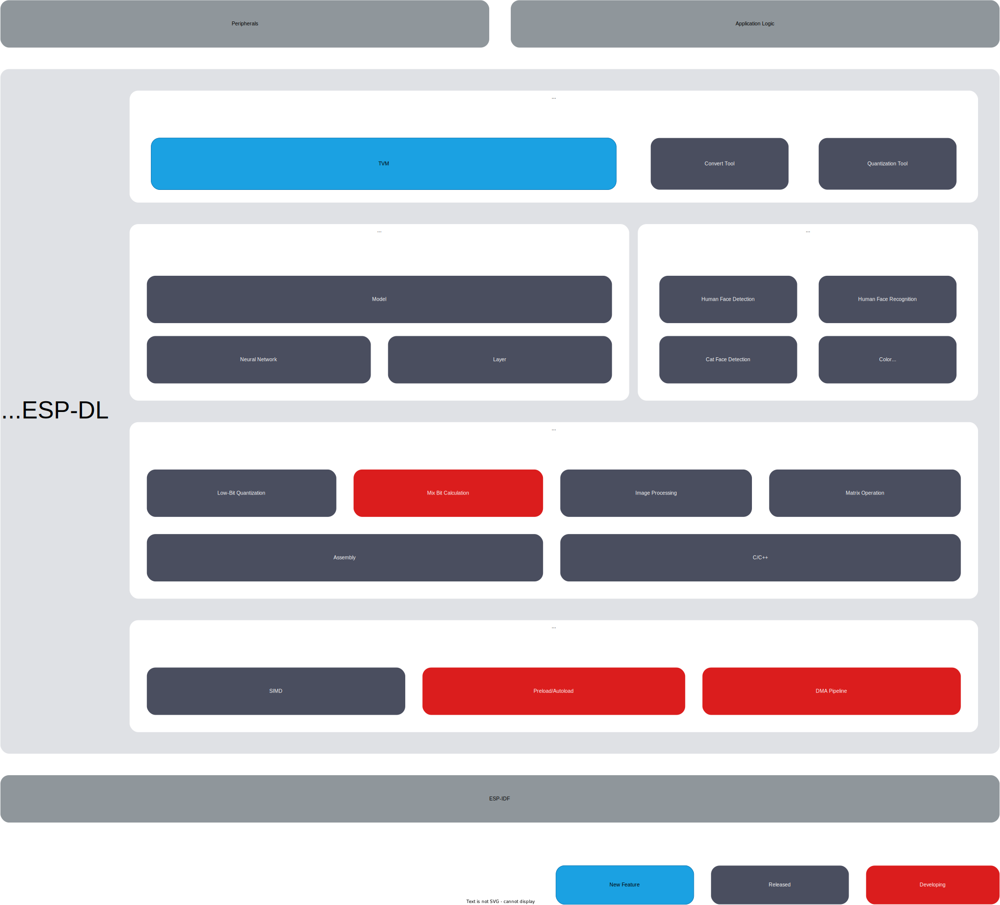

# ESP-DL [[中文]](./README_cn.md)

ESP-DL is a library for high-performance deep learning resources dedicated to [ESP32](https://www.espressif.com/en/products/socs/esp32), [ESP32-S2](https://www.espressif.com/en/products/socs/esp32-s2), [ESP32-S3](https://www.espressif.com/en/products/socs/esp32-s3) and [ESP32-C3](https://www.espressif.com/en/products/socs/esp32-c3).
Please read [ESP-DL User Guide](https://docs.espressif.com/projects/esp-dl/en/latest/esp32/index.html) for more information about ESP-DL.

## Overview

ESP-DL provides APIs for **Neural Network (NN) Inference**, **Image Processing**, **Math Operations** and some **Deep Learning Models**. With ESP-DL, you can use Espressif's SoCs for AI applications easily and fast.

As ESP-DL does not need any peripherals, it can be used as a component of some projects. For example, you can use it as a component of **[ESP-WHO](https://github.com/espressif/esp-who)**, which contains several project-level examples of image application. The figure below shows what ESP-DL consists of and how ESP-DL is implemented as a component in a project.

    

## Get Started with ESP-DL

For setup instructions to get started with ESP-DL, please read [Get Started](./docs/en/get_started.md).

> Please use [ESP-IDF](https://github.com/espressif/esp-idf) `release/v5.0` or above.

## Try Models in the Model Zoo

ESP-DL provides some model APIs in the [Model Zoo](./include/model_zoo), such as Human Face Detection, Human Face Recognition, Cat Face Detection, etc. You can use these models in the table below out of box.

| Name                 | API Example                                                  |
| :-------------------- | :------------------------------------------------------------ |
| Human Face Detection | [ESP-DL/examples/human_face_detect](examples/human_face_detect) |
| Human Face Recognition | [ESP-DL/examples/face_recognition](examples/face_recognition)  |
| Cat Face Detection | [ESP-DL/examples/cat_face_detect](examples/cat_face_detect)  |

## Deploy Your Own Models

We recommend using TVM to deploy your models, for details please refer to [ESP-DL/tutorial/tvm_example](tutorial/tvm_example).

## Feedback

For feature requests or bug reports, please submit an [issue](https://github.com/espressif/esp-dl/issues). We will prioritize the most anticipated features.
