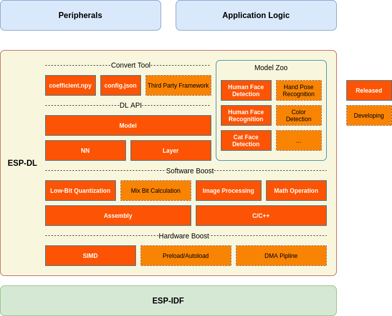

# ESP-DL

ESP-DL is a high-performance deep-learning library optimized for all Espressif Systems SoCs.

## Overview

ESP-DL provides API for **Neural Network Inference**, **Image Processing**, **Math Operation** and some **Deep-Learning Models**. With ESP-DL, we can run neural network inference easily and fast on Espressif Systems SoCs.

ESP-DL can be used as a component of some project as it doesn't need any peripherals. For example, we make it as a component of **[ESP-WHO](https://github.com/espressif/esp-who)**, which contains several project-level examples on image application. Here shows the position of ESP-DL in a project and what ESP-DL consists of.

## How TO

- [Get Started](./docs/en/get_started.md): introduce how to get ESP-DL.
- [Implement a Model](./tutorial): introduce how to implement a custom model step by step with a runnable example.

## Reference

### Convert Tool

With the help of config.json and convert.py, we can convert coefficient.npy in float-point to C/C++ in bit-quantize.

> We plan to support generate code directly from third-part-framework, like TensorFlow, PyTorch and etc,  in future.

- [Specification of config.json](./docs/en/specification_of_config_json.md)
- [Usage of convert.py](./docs/en/usage_of_convert_py.md)

### DL API

- [About Type Define](./docs/en/about_type_define.md): introduce two categories of data type.
- [Implement Custom Layer](./docs/en/implement_custom_layer.md): introduce how to implement your own layer step by step.
- [API Documentation](): introduce provided API about Layer, NN, Math and tools.

### Model Zoo

ESP-DL provides some model API in [./include/model_zoo/](./include/model_zoo), like Human Face Detection, Human Face Recognition, Cat Face Detection, etc. The table below lists the link to examples.

| Name                 | API Example                                                  | Application Example                                          |
| -------------------- | ------------------------------------------------------------ | ------------------------------------------------------------ |
| Human Face Detection | [ESP-DL/examples/human_face_detect](examples/human_face_detect) | [ESP-WHO/examples/human_face_detect](https://github.com/espressif/esp-who/tree/master/examples/human_face_detect) |
| Cat Face Detection   | [ESP-DL/examples/cat_face_detect](examples/cat_face_detect)  | [ESP-WHO/examples/cat_face_detect](https://github.com/espressif/esp-who/tree/master/examples/cat_face_detect) |

### Software & Hardware Boost

- [About Bit Quantize](./docs/en/about_bit_quantize.md): the rule of convert float-point to bit-quantize.

## Feedback

[Q&A](./docs/en/Q&A.md) collects frequently asked questions.

For feature requests or bug reports, please file an [issue](https://github.com/espressif/esp-dl/issues).

> Please feel free to open an issue and let us know what else operations that you expect. We will give priority to the implementation of the high voice.
