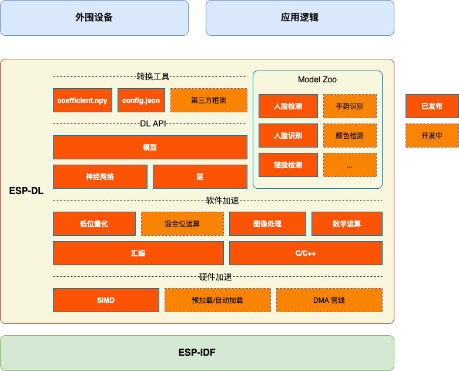

# ESP-DL [[English]](./README.md)

ESP-DL 是由乐鑫官方针对乐鑫各系列芯片产品所提供的高性能深度学习开发库。

## 概述

ESP-DL 为**神经网络推理**、**图像处理**、**数学运算**以及一些**深度学习模型**提供 API，通过 ESP-DL 能够快速便捷地将乐鑫各系列芯片产品用于人工智能应用。

ESP-DL 无需借助任何外围设备，因此可作为一些项目的组件，例如可将其作为 **[ESP-WHO](https://github.com/espressif/esp-who)** 的一个组件，该项目包含数个项目级图像应用实例。下图展示了 ESP-DL 的组成及作为组件时在项目中的位置。

     

## 入门指南

安装并入门 ESP-DL，请参考[快速入门](./docs/zh_CN/get_started.md)。

## 尝试模型库中的模型

ESP-DL 在 [模型库](./include/model_zoo) 中提供了一些模型的 API，如人脸检测、人脸识别、猫脸检测等。你可以使用下表中开箱即用的模型。

| 项目                 | API 实例                                                  | 应用实例                                          |
| -------------------- | ------------------------------------------------------------ | ------------------------------------------------------------ |
| 人脸检测 | [ESP-DL/examples/human_face_detect](examples/human_face_detect) | [ESP-WHO/examples/human_face_detect](https://github.com/espressif/esp-who/tree/master/examples/human_face_detect) |
| 猫脸检测   | [ESP-DL/examples/cat_face_detect](examples/cat_face_detect)  | [ESP-WHO/examples/cat_face_detect](https://github.com/espressif/esp-who/tree/master/examples/cat_face_detect) |

## 定制模型

如果你想要定制模型，请参考[定制模型的步骤介绍](./tutorial)，这一说明中包含一个可运行的实例，将帮助你迅速设计模型。

阅读上述文档时，你可能会用到以下资料：

- DL API
    * [变量与常量介绍](./docs/zh_CN/about_type_define.md)：其中提供的信息包括：
        - 变量：张量
        - 常量：过滤器，偏差，激活函数
    * [定制层的步骤介绍](./docs/zh_CN/implement_custom_layer.md)：介绍了如何定制层。
    * [API 文档]()：关于层、神经网络、数学和工具的 API 指南。

- 转换工具：可对 coefficient.npy 进行浮点量化的工具和配置文件。

  * config.json：请参考 [config.json 配置规范](./docs/zh_CN/specification_of_config_json.md)
  * convert.py：请参考 [convert.py 使用说明](./docs/zh_CN/usage_of_convert_py.md)

     > convert.py 需在 Python 3.7 或更高版本中运行。

- 软硬件加速
    * [量化规范](./docs/zh_CN/about_bit_quantize.md)：浮点量化规则

## 反馈

常见问题请参考 [Q&A](./docs/zh_CN/Q&A.md)。

如果你在使用中发现了错误或者需要新的功能，请提交相关 [issue](https://github.com/espressif/esp-dl/issues)，我们会优先实现最受期待的功能。