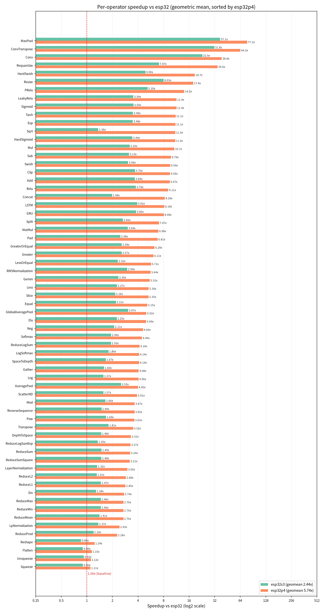

# ESP-DL Operator Cross-Target Benchmark Report

- esp-dl version: **3.3.10**
- Generated at: 2026-09-01 10:37:12
- Baseline target: **esp32** (normalized to 1.00x)
- Compared targets: **esp32s3**, **esp32p4**
- Test cases: 955 (cases common to every target)
- Aggregation: per-operator speedup is the **geometric mean** over its test cases; the range in parentheses is the min-max across those cases

## Per-Operator Speedup (esp32 = 1.00x)

65 operators in total:

| Operator | Cases | esp32 | esp32s3 | esp32p4 |
|---|--:|---:|---:|---:|
| Add | 54 | 1.00x | 3.69x (1.49-88.9) | 9.47x (3.38-149) |
| AveragePool | 20 | 1.00x | 2.53x (1.51-7.10) | 4.00x (3.26-9.23) |
| Clip | 4 | 1.00x | 3.70x (2.77-6.43) | 9.56x (4.54-25.7) |
| Concat | 6 | 1.00x | 1.98x (1.20-3.37) | 8.28x (2.05-73.9) |
| Conv | 78 | 1.00x | 22.9x (3.40-171) | 38.8x (3.54-283) |
| ConvTranspose | 14 | 1.00x | 31.8x (9.38-100) | 64.3x (18.5-213) |
| DepthToSpace | 8 | 1.00x | 1.48x (1.44-1.51) | 3.31x (2.78-3.61) |
| Div | 42 | 1.00x | 1.28x (1.00-2.35) | 2.74x (1.44-4.34) |
| Elu | 2 | 1.00x | 2.25x (2.19-2.31) | 4.99x (4.78-5.21) |
| Equal | 12 | 1.00x | 2.21x (1.91-2.85) | 5.15x (4.39-6.96) |
| Exp | 6 | 1.00x | 3.48x (2.55-5.28) | 11.1x (7.06-23.1) |
| Flatten | 6 | 1.00x | 0.90x (0.78-1.00) | 1.15x (1.07-1.25) |
| GRU | 12 | 1.00x | 3.80x (1.37-8.04) | 8.08x (1.69-42.7) |
| Gather | 6 | 1.00x | 1.60x (1.57-1.62) | 4.08x (3.93-4.23) |
| Gemm | 9 | 1.00x | 2.36x (1.81-3.31) | 5.52x (4.29-7.53) |
| GlobalAveragePool | 12 | 1.00x | 3.07x (1.74-5.57) | 5.02x (3.65-10.7) |
| Greater | 12 | 1.00x | 2.57x (2.23-3.35) | 6.11x (5.26-8.17) |
| GreaterOrEqual | 12 | 1.00x | 2.58x (2.21-3.57) | 6.28x (5.44-9.00) |
| HardSigmoid | 6 | 1.00x | 3.44x (2.55-5.11) | 11.0x (7.06-22.4) |
| HardSwish | 2 | 1.00x | 4.90x (4.72-5.08) | 18.7x (15.3-22.8) |
| LSTM | 12 | 1.00x | 3.92x (1.37-8.30) | 8.18x (1.79-41.8) |
| LayerNormalization | 6 | 1.00x | 1.32x (1.17-1.58) | 3.00x (2.63-3.61) |
| LeakyRelu | 6 | 1.00x | 3.54x (2.75-5.14) | 11.4x (7.84-23.4) |
| Less | 12 | 1.00x | 2.27x (1.95-3.17) | 5.36x (4.62-7.73) |
| LessOrEqual | 12 | 1.00x | 2.32x (2.00-3.10) | 5.71x (4.94-8.01) |
| Log | 6 | 1.00x | 1.57x (1.30-2.27) | 4.06x (3.22-6.25) |
| LogSoftmax | 6 | 1.00x | 1.80x (1.25-3.63) | 4.14x (2.98-7.49) |
| LpNormalization | 10 | 1.00x | 1.37x (1.25-1.68) | 2.43x (1.46-3.33) |
| MatMul | 38 | 1.00x | 3.04x (1.18-8.26) | 6.98x (2.33-21.9) |
| MaxPool | 20 | 1.00x | 37.1x (6.63-152) | 77.2x (9.51-270) |
| Mod | 12 | 1.00x | 1.66x (1.38-2.51) | 3.67x (2.29-6.07) |
| Mul | 56 | 1.00x | 3.20x (1.50-18.2) | 10.7x (3.26-147) |
| Neg | 6 | 1.00x | 2.11x (1.66-4.16) | 4.60x (3.32-10.2) |
| PRelu | 4 | 1.00x | 5.20x (3.41-9.81) | 14.0x (10.9-15.4) |
| Pad | 26 | 1.00x | 2.48x (1.75-4.63) | 6.81x (4.46-28.6) |
| Pow | 10 | 1.00x | 1.69x (1.23-2.27) | 3.63x (2.49-5.22) |
| RMSNormalization | 10 | 1.00x | 2.99x (2.25-5.00) | 5.64x (4.06-8.37) |
| ReduceL1 | 20 | 1.00x | 1.47x (0.90-3.11) | 2.85x (1.62-6.35) |
| ReduceL2 | 20 | 1.00x | 1.31x (0.92-1.95) | 2.88x (1.64-4.93) |
| ReduceLogSum | 20 | 1.00x | 1.93x (1.46-2.90) | 4.18x (1.95-7.75) |
| ReduceLogSumExp | 20 | 1.00x | 1.35x (1.19-1.72) | 3.27x (2.82-4.30) |
| ReduceMax | 20 | 1.00x | 1.46x (0.78-2.86) | 2.70x (1.38-6.06) |
| ReduceMean | 20 | 1.00x | 1.41x (0.87-2.63) | 2.70x (1.09-5.51) |
| ReduceMin | 20 | 1.00x | 1.46x (0.78-2.86) | 2.70x (1.41-6.04) |
| ReduceProd | 10 | 1.00x | 1.20x (1.08-1.49) | 2.28x (1.58-3.76) |
| ReduceSum | 20 | 1.00x | 1.49x (0.86-3.32) | 3.24x (2.03-6.15) |
| ReduceSumSquare | 20 | 1.00x | 1.48x (0.87-3.46) | 3.21x (1.92-6.46) |
| Relu | 6 | 1.00x | 3.78x (2.07-6.61) | 9.11x (3.14-15.3) |
| Requantize | 14 | 1.00x | 7.07x (5.01-10.9) | 34.6x (26.4-42.2) |
| Reshape | 6 | 1.00x | 0.86x (0.78-1.00) | 1.24x (1.17-1.25) |
| Resize | 14 | 1.00x | 8.03x (1.41-58.7) | 17.9x (3.64-131) |
| ReverseSequence | 4 | 1.00x | 1.49x (1.46-1.52) | 3.65x (3.46-3.84) |
| ScatterND | 12 | 1.00x | 1.57x (1.51-1.83) | 3.91x (3.50-5.48) |
| Sigmoid | 6 | 1.00x | 3.54x (2.72-5.28) | 11.4x (7.88-23.2) |
| Slice | 20 | 1.00x | 2.16x (1.63-6.32) | 5.35x (3.72-17.2) |
| Softmax | 6 | 1.00x | 1.94x (1.25-3.95) | 4.46x (2.96-7.97) |
| SpaceToDepth | 8 | 1.00x | 1.67x (1.49-1.98) | 4.14x (3.72-4.74) |
| Split | 4 | 1.00x | 2.66x (1.72-7.02) | 7.07x (5.00-14.6) |
| Sqrt | 6 | 1.00x | 1.36x (1.15-1.89) | 11.0x (8.76-15.9) |
| Squeeze | 6 | 1.00x | 0.90x (0.78-1.00) | 1.11x (1.00-1.17) |
| Sub | 56 | 1.00x | 3.13x (1.51-20.8) | 9.79x (3.57-108) |
| Swish | 2 | 1.00x | 3.06x (2.82-3.32) | 9.59x (9.41-9.78) |
| Tanh | 6 | 1.00x | 3.49x (2.66-5.16) | 11.1x (7.55-22.8) |
| Transpose | 6 | 1.00x | 1.81x (1.43-2.23) | 3.52x (2.54-4.20) |
| Unsqueeze | 8 | 1.00x | 0.92x (0.78-1.00) | 1.12x (1.00-1.17) |

## Per-Operator Speedup Bar Chart (esp32 = 1.00x)

## Total Test Time

Sum of the mean execution time (us) of all common test cases per target:

| Target | Total time (us) |
|--------|----------------:|
| esp32 | 11,492,626.6 |
| esp32s3 | 963,491.2 |
| esp32p4 | 320,828.7 |

## Notes

1. Speedup = baseline (esp32) time / target time; larger is faster. A value below 1.00x means the target is slower than the baseline on that operator.
2. Raw measurements below 2.0 us are clamped in the source data; 35 test cases are affected, so their speedups may be overestimated.
3. Test cases unique to `esp32p4` (352 cases) are excluded from the comparison; see the raw JSON for that target.
