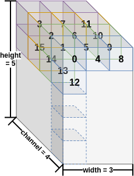
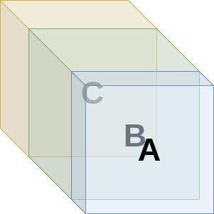
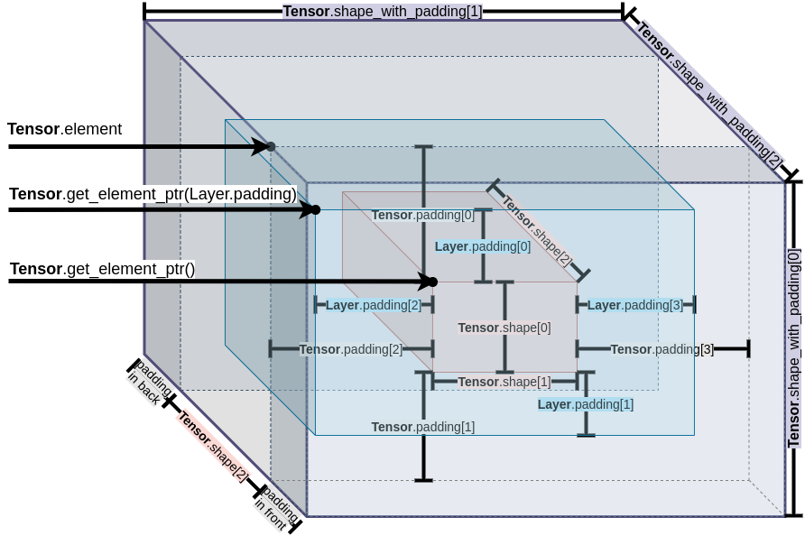

# About Type Define

ESP-DL has two categories of data types,

**Variable**: [Tensor](../../include/typedef/dl_variable.hpp/#15)

**Constant**: [Filter](../../include/typedef/dl_constant.hpp/#33), [Bias](../../include/typedef/dl_constant.hpp/#55), [Activation](../../include/typedef/dl_constant.hpp/#67)

## Tensor

Tensor is a data type for indicating feature map, e.g., input and output of a layer. Because of padding needed in some operation, the non-zero element may not continuous. It bothers custom layer implement. So, **If you want to implement a custom layer, please have a good look at it.**

### Tensor in 1D

As API for 1D operation is not ready, we do not talk about it right now.

### Tensor in 2D

#### Element Sequence

In 2D operation, input and output(collectively referred to as feature map) of a layer is 2D. The sequence of element is fixed, in [height, width, channel]. For example, I have a feature map with shape [5, 3, 4], all elements in memory are arranged as follows. 

#### About Padding

Things are not easy in some operations that need padded-input.

For example, in Conv2D, DepthwiseConv2D, etc, they probably need input padded in **left, right, top and bottom**. Further more, the same feature map could probably become several layer's input. Each layer probably needs different padding requirements. To avoid memory copy(which takes a lot of time), we apply a whole memory with the biggest padding of this feature map.

Specially, in Concat2D, We apply a whole memory for all feature map will be concatenated together. As it shows below, A, B and C are concatenated together along channel(ESP-DL only support this by now). When B becomes some layer's input, B actually has padding in **front and back**(probably top, bottom, left, right as well). Here, the expression of front and back padding in B may not be correct enough. Because there are meaningful elements in A and C.

According to these situations above, I draw a figure below. Among these labels in figure,

`Tensor.element`, `Tensor.shape`, `Tensor.padding` and `Tensor.shape_with_padding` could be found in [Tensor's member variables](../../include/typedef/dl_variable.hpp/#22) accordingly.

- `Tensor.element`: always point to that in figure. Although it has front and back padding.
- `Tensor.shape`: the shape without padded(the red box in figure).
- `Tensor.padding`: the padding size of red box. `Tensor.padding` should great equal than `Layer.padding` in each axis.

`Layer.padding` could be found as an example in [`dl_layer_conv2d.hpp`](../../include/layer/dl_layer_conv2d.hpp). This padding is for operation. So, `Layer.padding` should less equal than `Tensor.padding`.

#### In Application

**Tensor as an input:** Probably, we have a layer needs a padded input with padding size, `Layer.padding`. Then, we could get the pointer point to the beginning of padded input by [`Tensor.get_element_ptr(Layer.padding)`](../../include/typedef/dl_variable.hpp/#100). Be cautious that there are probably still some gabs between padded input(the blue box in figure) and padded tensor(the biggest box in figure).

**Tensor as an output:** The element of output is for storing result of a layer. It do not need padding as always. Then, we could get the pointer point the beginning of non-padded input by `Tensor.get_element_ptr()`.

**Be cautious about the pointer moving.**

## Filter, Bias and Activation

Compared with Tensor's, the definition of Filter, Bias and Activation is super simple(no padding thing at all). Just known that the sequence of `element` is flexible according to a specific operation. Nothing else worth to written in this document, please check the [`dl_constant.hpp`](../../include/typedef/dl_constant.hpp) or API Document.
