介绍
=====

:link_to_translation:`en:[English]`

ESP-DL 是由乐鑫官方针对乐鑫系列芯片 `ESP32 <https://www.espressif.com/en/products/socs/esp32>`__、`ESP32-S2 <https://www.espressif.com/en/products/socs/esp32-s2>`__、`ESP32-S3 <https://www.espressif.com/en/products/socs/esp32-s3>`__ 和 `ESP32-C3 <https://www.espressif.com/en/products/socs/esp32-c3>`__ 所提供的高性能深度学习开发库。

概述
----

ESP-DL 为 **神经网络推理**、**图像处理**、**数学运算**以及一些 **深度学习模型** 提供 API，通过 ESP-DL 能够快速便捷地将乐鑫各系列芯片产品用于人工智能应用。

ESP-DL 无需借助任何外围设备，因此可作为一些项目的组件，例如可将其作为 `ESP-WHO <https://github.com/espressif/esp-who>`__ 的一个组件，该项目包含数个项目级图像应用实例。下图展示了 ESP-DL 的组成及作为组件时在项目中的位置。

    架构概览

入门指南
--------

安装并入门 ESP-DL，请参考 :doc:`快速入门 <../../get-started>`。

请使用 ESP-IDF 5.0 或以上版本 `最新版本 <https://github.com/espressif/esp-idf>`__。

尝试模型库中的模型
------------------

ESP-DL 在 :project:`模型库 <include/model_zoo>` 中提供了一些模型的 API，如人脸检测、人脸识别、猫脸检测等。下表为 ESP-DL 所提供的模型，支持开箱即用。

.. list-table::
    :header-rows: 1
    :widths: 40 60
    :align: center

    * - 项目
      - API 实例
    * - 人脸检测
      - :example:`human_face_detect`
    * - 人脸识别
      - :example:`face_recognition`
    * - 猫脸检测
      - :example:`cat_face_detect`

部署模型
--------

如果想部署模型，请参考 :doc:`部署模型的步骤介绍 <../../tutorials/index>`，这一说明中包含三个可运行的实例，有助于迅速设计模型。

阅读上述文档时，可能会用到以下资料：

-  DL API

   -  :doc:`变量与常量 <../../glossary>`：其中提供的信息包括：

      -  变量：张量
      -  常量：过滤器、偏差、激活函数

   -  :doc:`定制层 <../../tutorials/customizing-a-layer-step-by-step>`：介绍如何定制层。

   -  :project:`API 文档 <include>`：关于层、神经网络、数学和工具的 API 指南。

         关于 API 的使用说明，请暂时查看头文件注释。

-  平台转换

   -  TVM（推荐）： 使用 AI 编译器 TVM 来部署模型，TVM 相关内容请参考 `TVM <https://tvm.apache.org/docs/>`__

   -  量化工具：用来量化浮点模型, 并评估定点模型在 ESP SoCs 上的表现

      -  量化工具：请参考 :doc:`量化工具包概览 <../../tools/quantization-toolkit/quantization-toolkit-overview>`
      -  量化工具 API：请参考 :doc:`量化工具包 API <../../tools/quantization-toolkit/quantization-toolkit-api>`

   -  转换工具：可对 ``coefficient.npy`` 进行浮点量化的工具和配置文件。

      -  ``config.json``：请参考 :doc:`config.json 配置规范 <../../tools/convert-tool/specification-of-config-json>`
      -  ``convert.py``：请参考 :doc:`convert.py 使用说明 <../../tools/convert-tool/usage-of-convert-tool>`

         ``convert.py`` 需在 Python 3.7 或更高版本中运行。

-  软硬件加速

   -  :doc:`量化规范 <../../tools/quantization-toolkit/quantization-specification>`：浮点量化规则

反馈
----

如果在使用中发现了错误或者需要新的功能，请提交相关 `issue <https://github.com/espressif/esp-dl/issues>`__，我们会优先实现最受期待的功能。
