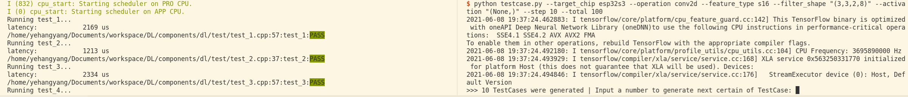

# TestCase.py

> This python code can help to generate some TestCases.


## Arguments Description

testcase.py has several optional arguments:

| arguments      | candidate value                                  | Must | Note                                                         |
| -------------- | ------------------------------------------------ | :--: | ------------------------------------------------------------ |
| --target_chip  | esp32, esp32s2, esp32c3, esp32s3                 | Yes  | accept one value only.                                       |
| --operation    | conv2d, depthwise_conv2d, max_pool2d, avg_pool2d, global_max_pool2d, global_avg_pool2d | Yes  | accept one value only.                                       |
| --feature_type | s16, s8                                          | Yes  | accept one value only.                                       |
| --filter_shape | "(H, W)", "(H, W, C, N)"                         |  No  | empty: all dimensions are random; "(H, W)": C and N are random; "(H, W, C, N)": as input |
| --input_shape  | "(H, W)"                                         |  No  | empty: H and W are random; "(H, W)": C is according to filter_shape |
| --stride       | "(1, Y, X, 1)"                                   |  No  | generated randomly if not setted.                            |
| --dilation     | "(Y, X)"                                         |  No  | generated randomly if not setted.                            |
| --activation   | None, "ReLU", "LeakyReLU", "PReLU"               |  No  | accept tuple only, e.g., "(None, \"ReLU\")". Test on all supported activation if not setted. |
| --step         | integer > 0                                      |  No  | As the size of Flash and PSRAM are limited, only 'step' number of TestCases are generated each time. Default  = 20. |
| --total        | integer > 0                                      |  No  | The 'total' number of TestCases to be generated. Default = 100. |
| --quant        | 0 or 1                                           |  No  | 0: per-layer quantization for int16 and int8 operations, 1: per-channel quantization for int8 conv2d and depthwise_conv2d |

Also, you can run `python testcase.py` or `python testcase.py -h` to get help menu.

```bash
optional arguments:
  -h, --help            show this help message and exit
  --target_chip TARGET_CHIP
                        ('esp32', 'esp32s2', 'esp32c3', 'esp32s3')
  --operation OPERATION
                        conv2d, depthwise_conv2d
  --feature_type FEATURE_TYPE
                        s16, s8
  --filter_shape FILTER_SHAPE
                        "(H, W, C, N)"
  --stride STRIDE       "(1, y, x, 1)"
  --dilation DILATION   "(y, x)"
  --activation ACTIVATION
                        "(None, \"ReLU\", \"LeakyReLU\", \"PReLU\")"
  --step STEP           Wait for every this number of testcases
  --total TOTAL         The total of testcases
  --quant QUANTIZATION   0 or 1
```


## How to use

1. Open a terminal.

2. Go to the root of ./component/dl/test/testcase.py. 

3. Run generator code:

   ```bash
   python testcase.py --target_chip esp32 --operation conv2d --feature_type s16 --filter_shape "(3,3,2,8)" --activation "(None,)" --step 10 --total 100
   ```

   Get informant as below. Now, 10 TestCases were generated for testing.

   ```bash
   >>> 10 TestCases were generated
   Input a number to continue or "exit" to exit:
   ```

   > After this 10 TestCases were tested, you can input a number to generate next certain of TestCase.
   >
   > DO NOT terminate the program until the testing finished. Once the program is terminated, generated TestCase files will be removed.
   >
   > Input "exit" to exit generator code. DO NOT use "ctrl + c".

4. Open a new terminal.

5. Go the root of ./test

6. Run test project code:

   ```bash
   idf.py -p /dev/ttyUSB0 -b 921600 flash monitor
   ```

   Test results are printed on terminal like this:

   
   
   
## Reference
[Unit Test](https://github.com/espressif/esp-idf/tree/master/examples/system/unit_test)