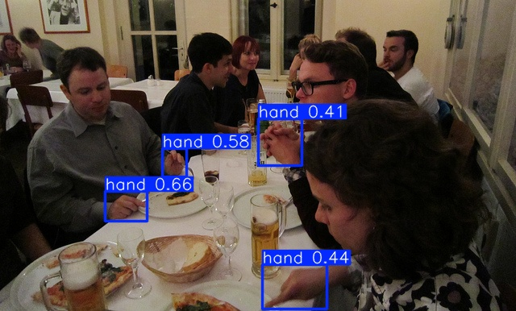

[supported]: https://img.shields.io/badge/-supported-green "supported"

| Chip     | ESP-IDF v5.3           | ESP-IDF v5.4           |
|----------|------------------------|------------------------|
| ESP32-S3 | ![alt text][supported] | ![alt text][supported] |
| ESP32-P4 | ![alt text][supported] | ![alt text][supported] |

# Hand Detect Example

A simple image inference example. In this example, we use ``hand.jpg`` for test. With default setting(iou=0.5, conf=0.25), the detection result before quantization is shown below:



And the detection result of espdet_pico_224_224_hand after int8 quantization on ESP32-P4 is as follows:


## Quick start

Follow the [quick start](https://docs.espressif.com/projects/esp-dl/en/latest/getting_started/readme.html#quick-start) to flash the example, you will see the output in idf monitor:

```
I (1570) hand_detect: [category: 0, score: 0.622459, x1: 135, y1: 240, x2: 187, y2: 275]
I (1570) hand_detect: [category: 0, score: 0.437824, x1: 318, y1: 148, x2: 377, y2: 208]
I (1580) hand_detect: [category: 0, score: 0.377541, x1: 335, y1: 330, x2: 404, y2: 380]
I (1580) hand_detect: [category: 0, score: 0.320821, x1: 205, y1: 187, x2: 234, y2: 220]
I (1590) main_task: Returned from app_main()

```

## Configurable Options in Menuconfig

### Component configuration
We provide the models as components, each of them has some configurable options.

### Project configuration

- CONFIG_PARTITION_TABLE_CUSTOM_FILENAME

If model location is set to FLASH partition, please set this option to `partitions2.csv`

