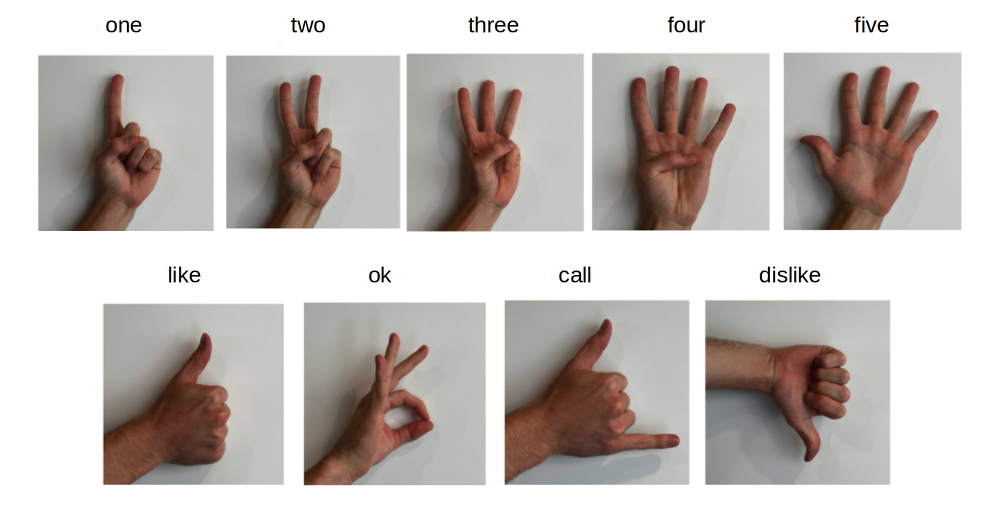

[supported]: https://img.shields.io/badge/-supported-green "supported"

| Chip     | ESP-IDF v5.3           | ESP-IDF v5.4           |
|----------|------------------------|------------------------|
| ESP32-S3 | ![alt text][supported] | ![alt text][supported] |
| ESP32-P4 | ![alt text][supported] | ![alt text][supported] |

# Hand Gesture Recognition Example

A simple image inference example. See full example in [esp-who](https://github.com/espressif/esp-who/tree/master/examples). We support 10 hand gestures plus a "no_hand" category. The gesture classes are selected from the [HaGRID](https://github.com/hukenovs/hagrid) dataset. The supported gestures are "one", "two", "three", "four", "five", "like", "ok", "no_gesture", "call", and "dislike". The class "no_gesture" represents a natural hand state or any hand gesture that does not belong to the 9 predefined gestures above. The 9 gesture classes are illustrated in the figure below. 



## Quick start

Follow the [quick start](https://docs.espressif.com/projects/esp-dl/en/latest/getting_started/readme.html#quick-start) to flash the example, you will see the output in idf monitor:

```
I (1942) hand_gesture_recognition: category: one, score: 0.999957
I (1952) main_task: Returned from app_main()

```
## Configurable Options in Menuconfig

### Component configuration
We provide the models as components, each of them has some configurable options. This example includes two models, one for hand detection and another for hand gesture classification. See

- [Hand Detect Model](https://github.com/espressif/esp-dl/blob/master/models/hand_detect/README.md)
- [Hand Gesture Classification Model](https://github.com/espressif/esp-dl/blob/master/models/hand_gesture_recognition/README.md)

### Project configuration

- CONFIG_PARTITION_TABLE_CUSTOM_FILENAME

If model location is set to FLASH partition, please set this option to `partitions2.csv`