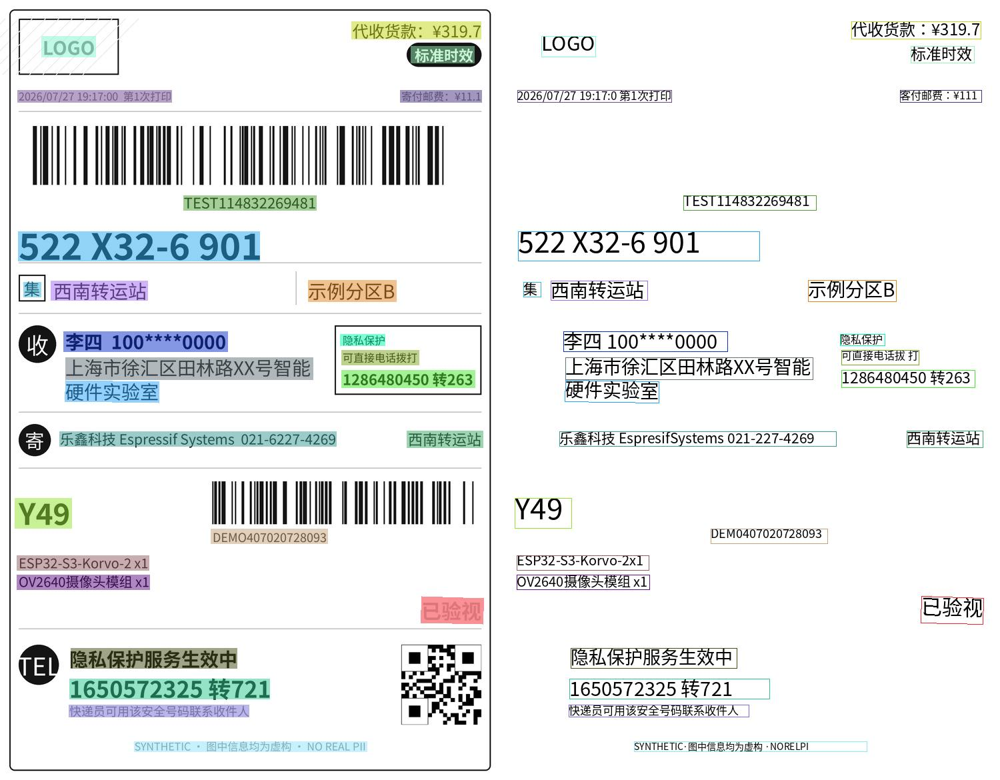
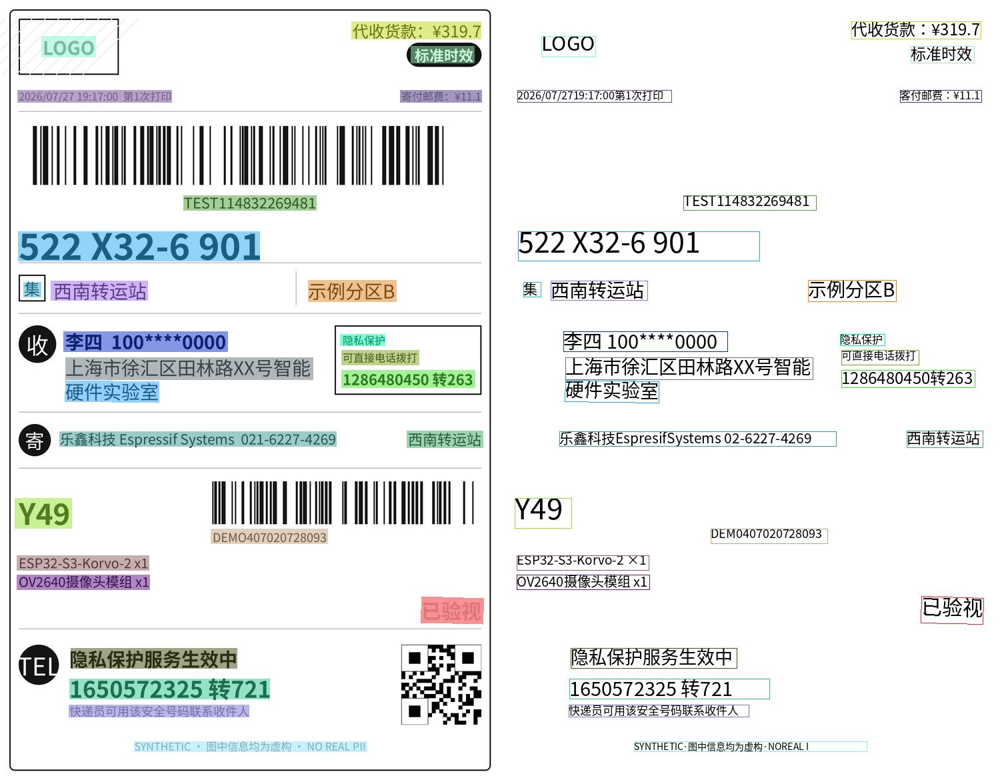

[supported]: https://img.shields.io/badge/-supported-green "supported"

| Chip     | ESP-IDF v5.3           | ESP-IDF v5.4           |
|----------|------------------------|------------------------|
| ESP32-P4 | ![alt text][supported] | ![alt text][supported] |

# PP-OCRv6 Example

A simple image inference example based on [PP-OCRv6](https://github.com/PaddlePaddle/PaddleOCR). It runs detection then recognition on the embedded ``pp_ocr_v6.jpg``, recognizing Chinese, English and 46 Latin-script languages on-device on ESP32-P4.

Fastest configuration on ESP32-P4: ``pp_ocr_v6_det_s8`` + ``pp_ocr_v6_rec_s8`` in Short mode. It reduces recognition latency, but may reduce accuracy compared with S16.



Default configuration on ESP32-P4: ``pp_ocr_v6_det_s8`` + ``pp_ocr_v6_rec_s16`` in Short mode.



Dual configuration on ESP32-P4: ``pp_ocr_v6_det_s8`` + ``pp_ocr_v6_rec_s16`` + ``pp_ocr_v6_rec_s16_w640``. Crops with W/H > 6.67 use the wide model to avoid horizontal squeezing.


## Quick start

Follow the [quick start](https://docs.espressif.com/projects/esp-dl/en/latest/getting_started/readme.html#quick-start) to flash the example, you will see the output in idf monitor:

```
I (1725) main_task: Calling app_main()
W (1945) FbsLoader: CONFIG_SPIRAM_RODATA or CONFIG_SPIRAM_XIP_FROM_PSRAM option is on, fbs model is copied to PSRAM.
W (2075) dl::Model: minimize() will delete unused inference variables, breaking model testing/debugging.
W (2075) FbsLoader: CONFIG_SPIRAM_RODATA or CONFIG_SPIRAM_XIP_FROM_PSRAM option is on, fbs model is copied to PSRAM.
W (2115) dl::Model: minimize() will delete unused inference variables, breaking model testing/debugging.
I (2115) pp_ocr_v6: rec mode: SHORT ('pp_ocr_v6_rec_s16.espdl', W/H=6.67)
I (17305) pp_ocr_v6: text="代收货款：¥319.7", score=0.9850, box=[527,32 721,32 721,58 527,58], det_score=0.8680
I (17305) pp_ocr_v6: text="LOGO", score=0.8365, box=[62,54 143,54 143,85 62,85], det_score=0.8039
I (17305) pp_ocr_v6: text="标准时效", score=0.9991, box=[616,69 711,69 711,94 616,94], det_score=0.8325
I (17315) pp_ocr_v6: text="2026/07/2719:17:00第1次打印", score=0.9681, box=[26,135 257,135 257,153 26,153], det_score=0.8936
I (17325) pp_ocr_v6: text="客付邮费：¥11.1", score=0.9272, box=[600,135 722,135 722,153 600,153], det_score=0.8977
I (17335) pp_ocr_v6: text="TEST114832269481", score=0.9663, box=[275,293 474,293 474,315 275,315], det_score=0.8685
I (17345) pp_ocr_v6: text="522 X32-6 901", score=0.9575, box=[27,347 389,347 389,391 27,391], det_score=0.9213
I (17355) pp_ocr_v6: text="集", score=0.9997, box=[35,423 61,423 61,445 35,445], det_score=0.6195
I (17365) pp_ocr_v6: text="西南转运站", score=0.9970, box=[76,421 221,421 221,450 76,450], det_score=0.9180
I (17375) pp_ocr_v6: text="示例分区B", score=0.9998, box=[462,420 594,420 594,452 462,452], det_score=0.9250
I (17385) pp_ocr_v6: text="李四 100****0000", score=0.9639, box=[95,497 341,497 341,527 95,527], det_score=0.8400
I (17395) pp_ocr_v6: text="隐私保护", score=1.0000, box=[510,501 577,501 577,518 510,518], det_score=0.9557
I (17405) pp_ocr_v6: text="可直接电话拨打", score=0.9907, box=[512,525 628,525 628,547 512,547], det_score=0.8813
I (17415) pp_ocr_v6: text="上海市徐汇区田林路XX号智能", score=0.9688, box=[98,536 469,536 469,569 98,569], det_score=0.8437
I (17435) pp_ocr_v6: text="1286480450转263", score=1.0000, box=[512,555 712,555 712,581 512,581], det_score=0.8443
I (17445) pp_ocr_v6: text="硬件实验室", score=1.0000, box=[98,570 238,572 238,604 97,602], det_score=0.8615
I (17455) pp_ocr_v6: text="乐鑫科技EspresifSystems 02-6227-4269", score=0.8035, box=[89,647 504,647 504,669 89,669], det_score=0.8815
I (17465) pp_ocr_v6: text="西南转运站", score=0.9995, box=[610,646 724,646 724,671 610,671], det_score=0.9388
I (17475) pp_ocr_v6: text="Y49", score=0.9878, box=[22,747 107,747 107,792 22,792], det_score=0.8291
I (17485) pp_ocr_v6: text="DEM0407020728093", score=0.9815, box=[316,793 491,793 491,815 316,815], det_score=0.8020
I (17495) pp_ocr_v6: text="ESP32-S3-Korvo-2 ×1", score=0.9641, box=[25,833 223,833 223,855 25,855], det_score=0.8760
I (17505) pp_ocr_v6: text="OV2640摄像头模组 x1", score=0.9590, box=[25,862 224,862 224,884 25,884], det_score=0.9511
I (17515) pp_ocr_v6: text="已验视", score=0.9991, box=[632,894 725,897 724,936 631,934], det_score=0.7228
I (17525) pp_ocr_v6: text="隐私保护服务生效中", score=1.0000, box=[106,972 355,972 355,1002 106,1002], det_score=0.8651
I (17535) pp_ocr_v6: text="1650572325 转721", score=0.9462, box=[104,1018 404,1018 404,1048 104,1048], det_score=0.9653
I (17545) pp_ocr_v6: text="快递员可用该安全号码联系收件人", score=0.9997, box=[103,1057 373,1057 373,1075 103,1075], det_score=0.8066
I (17555) pp_ocr_v6: text="SYNTHETIC·图中信息均为虚构·NOREAL I", score=0.9146, box=[201,1112 550,1112 550,1127 201,1127], det_score=0.9409
I (17565) pp_ocr_v6: OCR results: 27
I (17575) main_task: Returned from app_main()
```

Optional: draw the serial log with ``tools/visualize_result.py`` (same image as the firmware embed).

## Configurable Options in Menuconfig

### Component configuration
We provide the models as components, each of them has some configurable options. See [PP-OCRv6 Model](../../models/pp_ocr_v6).

### Project configuration

- CONFIG_PARTITION_TABLE_CUSTOM_FILENAME

Use `partitions.csv` for `flash_rodata`. It embeds the selected models in the app firmware.

When model location is set to `flash_partition`, set this option to
`partitions2.csv`. It stores the packed model file in the `pp_ocr_v6` Flash
partition; its 6MB size supports the Dual S16 model package.
