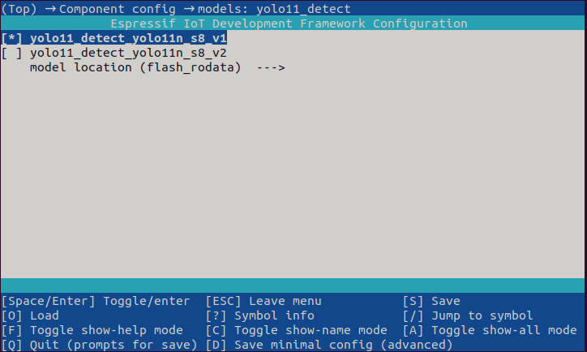
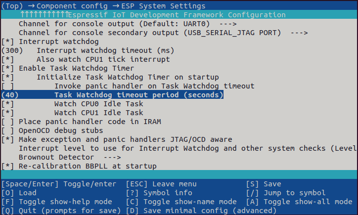
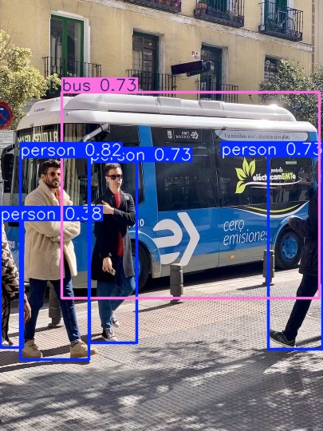

| Supported Targets | ESP32-S3 | ESP32-P4 |
| ----------------- | -------- | -------- |


# Yolo11n Detect Example

## Run the Example

Run the example with default setting following steps:

```
idf.py set-target [Soc]
```

```
idf.py flash monitor
```

## Configure Yolo11n Model

In addition to default setting, this example allows you to configure model version. Currently, we support two different versions of models. You can choose one of them in menuconfig  models: yolo11_detect option. As for model performance, please refer to [Models README](../../models/coco_detect/README.md) for more information. 

Steps to configure yolo11n model is as follows:

Run `idf.py menuconfig` in the terminal and click (Top) -> Component config -> models: yolo11_detect to enter the model configuration interface, as shown below:



You can choose the yolo11n model according to your needs.

If you want to run your own model, which is not shown in the figure above, you can register your own model and configure the model correspondingly. 

Once you have finished the model configuration, Flash and Monitor the model.

```
idf.py flash monitor
```

## Configure Task Watchdog 

In addition to default setting, configure Task Watchdog timeout period is recommended when running yolo11n model on ESP32-S3. 

Steps to configure Task Watchdog timeout period is as follows:

Run `idf.py menuconfig` in the terminal and click (Top) -> Component config -> ESP System Settings to enter the configuration interface, and then set it to 40, as shown below:



Once you have finished the task watchdog configuration, Flash and Monitor the model.

```
idf.py flash monitor
```

# Example Output

Take the int8 quantized yolo11n model running on ESP32-P4 for example. After the flashing, you should see the output at idf monitor:

```
I (1929) dl::Model: model:main_graph, version:0

I (1929) dl::Model: /model.0/conv/Conv: Conv
I (1929) dl::Model: /model.0/act/Sigmoid: Sigmoid
I (1929) dl::Model: /model.0/act/Mul: Mul
I (1939) dl::Model: /model.1/conv/Conv: Conv
I (1939) dl::Model: /model.1/act/Sigmoid: Sigmoid
I (1949) dl::Model: /model.1/act/Mul: Mul
I (1949) dl::Model: /model.2/cv1/conv/Conv: Conv
I (1959) dl::Model: /model.2/cv1/act/Sigmoid: Sigmoid
I (1959) dl::Model: /model.2/cv1/act/Mul: Mul
I (1969) dl::Model: /model.2/Split: Split
I (1969) dl::Model: PPQ_Operation_2: RequantizeLinear
I (1979) dl::Model: /model.2/m.0/cv1/conv/Conv: Conv
I (1979) dl::Model: PPQ_Operation_1: RequantizeLinear
I (1989) dl::Model: PPQ_Operation_3: RequantizeLinear
I (1989) dl::Model: /model.2/m.0/cv1/act/Sigmoid: Sigmoid
I (1999) dl::Model: /model.2/m.0/cv1/act/Mul: Mul
I (2009) dl::Model: /model.2/m.0/cv2/conv/Conv: Conv
I (2009) dl::Model: /model.2/m.0/cv2/act/Sigmoid: Sigmoid
I (2019) dl::Model: /model.2/m.0/cv2/act/Mul: Mul
I (2019) dl::Model: /model.2/m.0/Add: Add
I (2029) dl::Model: /model.2/Concat: Concat
I (2029) dl::Model: /model.2/cv2/conv/Conv: Conv
I (2039) dl::Model: /model.2/cv2/act/Sigmoid: Sigmoid
I (2039) dl::Model: /model.2/cv2/act/Mul: Mul
I (2049) dl::Model: /model.3/conv/Conv: Conv
I (2049) dl::Model: /model.3/act/Sigmoid: Sigmoid
I (2059) dl::Model: /model.3/act/Mul: Mul
I (2059) dl::Model: /model.4/cv1/conv/Conv: Conv
I (2069) dl::Model: /model.4/cv1/act/Sigmoid: Sigmoid
I (2069) dl::Model: /model.4/cv1/act/Mul: Mul
I (2079) dl::Model: /model.4/Split: Split
I (2079) dl::Model: PPQ_Operation_5: RequantizeLinear
I (2089) dl::Model: /model.4/m.0/cv1/conv/Conv: Conv
I (2099) dl::Model: PPQ_Operation_4: RequantizeLinear
I (2099) dl::Model: PPQ_Operation_6: RequantizeLinear
I (2109) dl::Model: /model.4/m.0/cv1/act/Sigmoid: Sigmoid
I (2109) dl::Model: /model.4/m.0/cv1/act/Mul: Mul
I (2119) dl::Model: /model.4/m.0/cv2/conv/Conv: Conv
I (2119) dl::Model: /model.4/m.0/cv2/act/Sigmoid: Sigmoid
I (2129) dl::Model: /model.4/m.0/cv2/act/Mul: Mul
I (2139) dl::Model: /model.4/m.0/Add: Add
I (2139) dl::Model: /model.4/Concat: Concat
I (2149) dl::Model: /model.4/cv2/conv/Conv: Conv
I (2149) dl::Model: /model.4/cv2/act/Sigmoid: Sigmoid
I (2159) dl::Model: /model.4/cv2/act/Mul: Mul
I (2159) dl::Model: /model.5/conv/Conv: Conv
I (2169) dl::Model: /model.5/act/Sigmoid: Sigmoid
I (2169) dl::Model: /model.5/act/Mul: Mul
I (2179) dl::Model: /model.6/cv1/conv/Conv: Conv
I (2179) dl::Model: /model.6/cv1/act/Sigmoid: Sigmoid
I (2189) dl::Model: /model.6/cv1/act/Mul: Mul
I (2189) dl::Model: /model.6/Split: Split
I (2199) dl::Model: /model.6/m.0/cv1/conv/Conv: Conv
I (2199) dl::Model: /model.6/m.0/cv2/conv/Conv: Conv
I (2209) dl::Model: /model.6/m.0/cv1/act/Sigmoid: Sigmoid
I (2209) dl::Model: /model.6/m.0/cv2/act/Sigmoid: Sigmoid
I (2219) dl::Model: /model.6/m.0/cv1/act/Mul: Mul
I (2229) dl::Model: /model.6/m.0/cv2/act/Mul: Mul
I (2229) dl::Model: /model.6/m.0/m/m.0/cv1/conv/Conv: Conv
I (2239) dl::Model: PPQ_Operation_7: RequantizeLinear
I (2239) dl::Model: /model.6/m.0/m/m.0/cv1/act/Sigmoid: Sigmoid
I (2249) dl::Model: /model.6/m.0/m/m.0/cv1/act/Mul: Mul
I (2259) dl::Model: /model.6/m.0/m/m.0/cv2/conv/Conv: Conv
I (2259) dl::Model: /model.6/m.0/m/m.0/cv2/act/Sigmoid: Sigmoid
I (2269) dl::Model: /model.6/m.0/m/m.0/cv2/act/Mul: Mul
I (2269) dl::Model: /model.6/m.0/m/m.0/Add: Add
I (2279) dl::Model: /model.6/m.0/m/m.1/cv1/conv/Conv: Conv
I (2289) dl::Model: /model.6/m.0/m/m.1/cv1/act/Sigmoid: Sigmoid
I (2289) dl::Model: /model.6/m.0/m/m.1/cv1/act/Mul: Mul
I (2299) dl::Model: /model.6/m.0/m/m.1/cv2/conv/Conv: Conv
I (2299) dl::Model: /model.6/m.0/m/m.1/cv2/act/Sigmoid: Sigmoid
I (2309) dl::Model: /model.6/m.0/m/m.1/cv2/act/Mul: Mul
I (2319) dl::Model: /model.6/m.0/m/m.1/Add: Add
I (2319) dl::Model: /model.6/m.0/Concat: Concat
I (2329) dl::Model: /model.6/m.0/cv3/conv/Conv: Conv
I (2329) dl::Model: /model.6/m.0/cv3/act/Sigmoid: Sigmoid
I (2339) dl::Model: /model.6/m.0/cv3/act/Mul: Mul
I (2339) dl::Model: /model.6/Concat: Concat
I (2349) dl::Model: /model.6/cv2/conv/Conv: Conv
I (2349) dl::Model: /model.6/cv2/act/Sigmoid: Sigmoid
I (2359) dl::Model: /model.6/cv2/act/Mul: Mul
I (2369) dl::Model: /model.7/conv/Conv: Conv
I (2369) dl::Model: /model.7/act/Sigmoid: Sigmoid
I (2379) dl::Model: /model.7/act/Mul: Mul
I (2379) dl::Model: /model.8/cv1/conv/Conv: Conv
I (2389) dl::Model: /model.8/cv1/act/Sigmoid: Sigmoid
I (2389) dl::Model: /model.8/cv1/act/Mul: Mul
I (2399) dl::Model: /model.8/Split: Split
I (2399) dl::Model: PPQ_Operation_9: RequantizeLinear
I (2409) dl::Model: /model.8/m.0/cv1/conv/Conv: Conv
I (2409) dl::Model: /model.8/m.0/cv2/conv/Conv: Conv
I (2419) dl::Model: PPQ_Operation_10: RequantizeLinear
I (2419) dl::Model: /model.8/m.0/cv1/act/Sigmoid: Sigmoid
I (2429) dl::Model: /model.8/m.0/cv2/act/Sigmoid: Sigmoid
I (2439) dl::Model: /model.8/m.0/cv1/act/Mul: Mul
I (2439) dl::Model: /model.8/m.0/cv2/act/Mul: Mul
I (2449) dl::Model: /model.8/m.0/m/m.0/cv1/conv/Conv: Conv
I (2449) dl::Model: PPQ_Operation_8: RequantizeLinear
I (2459) dl::Model: /model.8/m.0/m/m.0/cv1/act/Sigmoid: Sigmoid
I (2469) dl::Model: /model.8/m.0/m/m.0/cv1/act/Mul: Mul
I (2469) dl::Model: /model.8/m.0/m/m.0/cv2/conv/Conv: Conv
I (2479) dl::Model: /model.8/m.0/m/m.0/cv2/act/Sigmoid: Sigmoid
I (2479) dl::Model: /model.8/m.0/m/m.0/cv2/act/Mul: Mul
I (2489) dl::Model: /model.8/m.0/m/m.0/Add: Add
I (2499) dl::Model: /model.8/m.0/m/m.1/cv1/conv/Conv: Conv
I (2499) dl::Model: /model.8/m.0/m/m.1/cv1/act/Sigmoid: Sigmoid
I (2509) dl::Model: /model.8/m.0/m/m.1/cv1/act/Mul: Mul
I (2509) dl::Model: /model.8/m.0/m/m.1/cv2/conv/Conv: Conv
I (2519) dl::Model: /model.8/m.0/m/m.1/cv2/act/Sigmoid: Sigmoid
I (2529) dl::Model: /model.8/m.0/m/m.1/cv2/act/Mul: Mul
I (2529) dl::Model: /model.8/m.0/m/m.1/Add: Add
I (2539) dl::Model: /model.8/m.0/Concat: Concat
I (2539) dl::Model: /model.8/m.0/cv3/conv/Conv: Conv
I (2549) dl::Model: /model.8/m.0/cv3/act/Sigmoid: Sigmoid
I (2549) dl::Model: /model.8/m.0/cv3/act/Mul: Mul
I (2559) dl::Model: /model.8/Concat: Concat
I (2559) dl::Model: /model.8/cv2/conv/Conv: Conv
I (2569) dl::Model: /model.8/cv2/act/Sigmoid: Sigmoid
I (2579) dl::Model: /model.8/cv2/act/Mul: Mul
I (2579) dl::Model: /model.9/cv1/conv/Conv: Conv
I (2589) dl::Model: /model.9/cv1/act/Sigmoid: Sigmoid
I (2589) dl::Model: /model.9/cv1/act/Mul: Mul
I (2599) dl::Model: /model.9/m/MaxPool: MaxPool
I (2599) dl::Model: /model.9/m_1/MaxPool: MaxPool
I (2609) dl::Model: /model.9/m_2/MaxPool: MaxPool
I (2609) dl::Model: /model.9/Concat: Concat
I (2619) dl::Model: /model.9/cv2/conv/Conv: Conv
I (2619) dl::Model: /model.9/cv2/act/Sigmoid: Sigmoid
I (2629) dl::Model: /model.9/cv2/act/Mul: Mul
I (2629) dl::Model: /model.10/cv1/conv/Conv: Conv
I (2639) dl::Model: /model.10/cv1/act/Sigmoid: Sigmoid
I (2649) dl::Model: /model.10/cv1/act/Mul: Mul
I (2649) dl::Model: /model.10/Split: Split
I (2659) dl::Model: /model.10/m/m.0/attn/qkv/conv/Conv: Conv
I (2659) dl::Model: PPQ_Operation_12: RequantizeLinear
I (2669) dl::Model: PPQ_Operation_31: Transpose
I (2669) dl::Model: /model.10/m/m.0/attn/Reshape: Reshape
I (2679) dl::Model: /model.10/m/m.0/attn/Split: Split
I (2679) dl::Model: /model.10/m/m.0/attn/Transpose: Transpose
I (2689) dl::Model: PPQ_Operation_25: Reshape
I (2699) dl::Model: /model.10/m/m.0/attn/Reshape_2: Reshape
I (2699) dl::Model: PPQ_Operation_26: Transpose
I (2709) dl::Model: PPQ_Operation_32: Transpose
I (2709) dl::Model: PPQ_Operation_27: Reshape
I (2719) dl::Model: /model.10/m/m.0/attn/pe/conv/Conv: Conv
I (2719) dl::Model: /model.10/m/m.0/attn/MatMul: MatMul
I (2729) dl::Model: PPQ_Operation_33: Transpose
I (2729) dl::Model: /model.10/m/m.0/attn/Mul: Mul
I (2739) dl::Model: /model.10/m/m.0/attn/Softmax: Softmax
I (2749) dl::Model: PPQ_Operation_0: QuantizeLinear
I (2749) dl::Model: /model.10/m/m.0/attn/Transpose_1: Transpose
I (2759) dl::Model: PPQ_Operation_28: Reshape
I (2759) dl::Model: PPQ_Operation_29: Transpose
I (2769) dl::Model: PPQ_Operation_30: Reshape
I (2769) dl::Model: /model.10/m/m.0/attn/MatMul_1: MatMul
I (2779) dl::Model: /model.10/m/m.0/attn/Reshape_1: Reshape
I (2789) dl::Model: PPQ_Operation_11: RequantizeLinear
I (2789) dl::Model: /model.10/m/m.0/attn/Add: Add
I (2799) dl::Model: PPQ_Operation_34: Transpose
I (2799) dl::Model: /model.10/m/m.0/attn/proj/conv/Conv: Conv
I (2809) dl::Model: /model.10/m/m.0/Add: Add
I (2809) dl::Model: /model.10/m/m.0/ffn/ffn.0/conv/Conv: Conv
I (2819) dl::Model: PPQ_Operation_13: RequantizeLinear
I (2829) dl::Model: /model.10/m/m.0/ffn/ffn.0/act/Sigmoid: Sigmoid
I (2829) dl::Model: /model.10/m/m.0/ffn/ffn.0/act/Mul: Mul
I (2839) dl::Model: /model.10/m/m.0/ffn/ffn.1/conv/Conv: Conv
I (2849) dl::Model: /model.10/m/m.0/Add_1: Add
I (2849) dl::Model: /model.10/Concat: Concat
I (2859) dl::Model: /model.10/cv2/conv/Conv: Conv
I (2859) dl::Model: /model.10/cv2/act/Sigmoid: Sigmoid
I (2869) dl::Model: /model.10/cv2/act/Mul: Mul
I (2869) dl::Model: PPQ_Operation_14: RequantizeLinear
I (2879) dl::Model: /model.11/Resize: Resize
I (2879) dl::Model: /model.12/Concat: Concat
I (2889) dl::Model: /model.13/cv1/conv/Conv: Conv
I (2889) dl::Model: /model.13/cv1/act/Sigmoid: Sigmoid
I (2899) dl::Model: /model.13/cv1/act/Mul: Mul
I (2899) dl::Model: /model.13/Split: Split
I (2909) dl::Model: /model.13/m.0/cv1/conv/Conv: Conv
I (2909) dl::Model: /model.13/m.0/cv1/act/Sigmoid: Sigmoid
I (2919) dl::Model: /model.13/m.0/cv1/act/Mul: Mul
I (2929) dl::Model: /model.13/m.0/cv2/conv/Conv: Conv
I (2929) dl::Model: /model.13/m.0/cv2/act/Sigmoid: Sigmoid
I (2939) dl::Model: /model.13/m.0/cv2/act/Mul: Mul
I (2939) dl::Model: /model.13/m.0/Add: Add
I (2949) dl::Model: /model.13/Concat: Concat
I (2949) dl::Model: /model.13/cv2/conv/Conv: Conv
I (2959) dl::Model: /model.13/cv2/act/Sigmoid: Sigmoid
I (2959) dl::Model: /model.13/cv2/act/Mul: Mul
I (2969) dl::Model: /model.14/Resize: Resize
I (2969) dl::Model: /model.15/Concat: Concat
I (2979) dl::Model: /model.16/cv1/conv/Conv: Conv
I (2979) dl::Model: /model.16/cv1/act/Sigmoid: Sigmoid
I (2989) dl::Model: /model.16/cv1/act/Mul: Mul
I (2999) dl::Model: /model.16/Split: Split
I (2999) dl::Model: PPQ_Operation_16: RequantizeLinear
I (3009) dl::Model: /model.16/m.0/cv1/conv/Conv: Conv
I (3009) dl::Model: PPQ_Operation_15: RequantizeLinear
I (3019) dl::Model: PPQ_Operation_17: RequantizeLinear
I (3019) dl::Model: /model.16/m.0/cv1/act/Sigmoid: Sigmoid
I (3029) dl::Model: /model.16/m.0/cv1/act/Mul: Mul
I (3039) dl::Model: /model.16/m.0/cv2/conv/Conv: Conv
I (3039) dl::Model: /model.16/m.0/cv2/act/Sigmoid: Sigmoid
I (3049) dl::Model: /model.16/m.0/cv2/act/Mul: Mul
I (3049) dl::Model: /model.16/m.0/Add: Add
I (3059) dl::Model: /model.16/Concat: Concat
I (3059) dl::Model: /model.16/cv2/conv/Conv: Conv
I (3069) dl::Model: /model.16/cv2/act/Sigmoid: Sigmoid
I (3069) dl::Model: /model.16/cv2/act/Mul: Mul
I (3079) dl::Model: /model.17/conv/Conv: Conv
I (3079) dl::Model: /model.23/cv2.0/cv2.0.0/conv/Conv: Conv
I (3089) dl::Model: /model.23/cv3.0/cv3.0.0/cv3.0.0.0/conv/Conv: Conv
I (3099) dl::Model: /model.17/act/Sigmoid: Sigmoid
I (3099) dl::Model: /model.23/cv2.0/cv2.0.0/act/Sigmoid: Sigmoid
I (3109) dl::Model: /model.23/cv3.0/cv3.0.0/cv3.0.0.0/act/Sigmoid: Sigmoid
I (3119) dl::Model: /model.17/act/Mul: Mul
I (3119) dl::Model: /model.23/cv2.0/cv2.0.0/act/Mul: Mul
I (3129) dl::Model: /model.23/cv3.0/cv3.0.0/cv3.0.0.0/act/Mul: Mul
I (3129) dl::Model: /model.18/Concat: Concat
I (3139) dl::Model: /model.23/cv2.0/cv2.0.1/conv/Conv: Conv
I (3149) dl::Model: /model.23/cv3.0/cv3.0.0/cv3.0.0.1/conv/Conv: Conv
I (3149) dl::Model: /model.19/cv1/conv/Conv: Conv
I (3159) dl::Model: /model.23/cv2.0/cv2.0.1/act/Sigmoid: Sigmoid
I (3159) dl::Model: /model.23/cv3.0/cv3.0.0/cv3.0.0.1/act/Sigmoid: Sigmoid
I (3169) dl::Model: /model.19/cv1/act/Sigmoid: Sigmoid
I (3179) dl::Model: /model.23/cv2.0/cv2.0.1/act/Mul: Mul
I (3179) dl::Model: /model.23/cv3.0/cv3.0.0/cv3.0.0.1/act/Mul: Mul
I (3189) dl::Model: /model.19/cv1/act/Mul: Mul
I (3199) dl::Model: /model.23/cv2.0/cv2.0.2/Conv: Conv
I (3199) dl::Model: /model.23/cv3.0/cv3.0.1/cv3.0.1.0/conv/Conv: Conv
I (3209) dl::Model: /model.19/Split: Split
I (3209) dl::Model: /model.23/cv3.0/cv3.0.1/cv3.0.1.0/act/Sigmoid: Sigmoid
I (3219) dl::Model: PPQ_Operation_19: RequantizeLinear
I (3229) dl::Model: /model.19/m.0/cv1/conv/Conv: Conv
I (3229) dl::Model: PPQ_Operation_18: RequantizeLinear
I (3239) dl::Model: PPQ_Operation_20: RequantizeLinear
I (3239) dl::Model: /model.23/cv3.0/cv3.0.1/cv3.0.1.0/act/Mul: Mul
I (3249) dl::Model: /model.19/m.0/cv1/act/Sigmoid: Sigmoid
I (3259) dl::Model: /model.23/cv3.0/cv3.0.1/cv3.0.1.1/conv/Conv: Conv
I (3259) dl::Model: /model.19/m.0/cv1/act/Mul: Mul
I (3269) dl::Model: /model.23/cv3.0/cv3.0.1/cv3.0.1.1/act/Sigmoid: Sigmoid
I (3279) dl::Model: /model.19/m.0/cv2/conv/Conv: Conv
I (3279) dl::Model: /model.23/cv3.0/cv3.0.1/cv3.0.1.1/act/Mul: Mul
I (3289) dl::Model: /model.19/m.0/cv2/act/Sigmoid: Sigmoid
I (3299) dl::Model: /model.23/cv3.0/cv3.0.2/Conv: Conv
I (3299) dl::Model: /model.19/m.0/cv2/act/Mul: Mul
I (3309) dl::Model: /model.19/m.0/Add: Add
I (3309) dl::Model: /model.19/Concat: Concat
I (3319) dl::Model: /model.19/cv2/conv/Conv: Conv
I (3319) dl::Model: /model.19/cv2/act/Sigmoid: Sigmoid
I (3329) dl::Model: /model.19/cv2/act/Mul: Mul
I (3329) dl::Model: /model.20/conv/Conv: Conv
I (3339) dl::Model: /model.23/cv2.1/cv2.1.0/conv/Conv: Conv
I (3349) dl::Model: /model.23/cv3.1/cv3.1.0/cv3.1.0.0/conv/Conv: Conv
I (3349) dl::Model: /model.20/act/Sigmoid: Sigmoid
I (3359) dl::Model: /model.23/cv2.1/cv2.1.0/act/Sigmoid: Sigmoid
I (3359) dl::Model: /model.23/cv3.1/cv3.1.0/cv3.1.0.0/act/Sigmoid: Sigmoid
I (3369) dl::Model: /model.20/act/Mul: Mul
I (3379) dl::Model: /model.23/cv2.1/cv2.1.0/act/Mul: Mul
I (3379) dl::Model: /model.23/cv3.1/cv3.1.0/cv3.1.0.0/act/Mul: Mul
I (3389) dl::Model: /model.21/Concat: Concat
I (3389) dl::Model: /model.23/cv2.1/cv2.1.1/conv/Conv: Conv
I (3399) dl::Model: /model.23/cv3.1/cv3.1.0/cv3.1.0.1/conv/Conv: Conv
I (3409) dl::Model: /model.22/cv1/conv/Conv: Conv
I (3409) dl::Model: /model.23/cv2.1/cv2.1.1/act/Sigmoid: Sigmoid
I (3419) dl::Model: /model.23/cv3.1/cv3.1.0/cv3.1.0.1/act/Sigmoid: Sigmoid
I (3429) dl::Model: /model.22/cv1/act/Sigmoid: Sigmoid
I (3429) dl::Model: /model.23/cv2.1/cv2.1.1/act/Mul: Mul
I (3439) dl::Model: /model.23/cv3.1/cv3.1.0/cv3.1.0.1/act/Mul: Mul
I (3449) dl::Model: /model.22/cv1/act/Mul: Mul
I (3449) dl::Model: /model.23/cv2.1/cv2.1.2/Conv: Conv
I (3459) dl::Model: /model.23/cv3.1/cv3.1.1/cv3.1.1.0/conv/Conv: Conv
I (3459) dl::Model: /model.22/Split: Split
I (3469) dl::Model: /model.23/cv3.1/cv3.1.1/cv3.1.1.0/act/Sigmoid: Sigmoid
I (3479) dl::Model: PPQ_Operation_23: RequantizeLinear
I (3479) dl::Model: /model.22/m.0/cv1/conv/Conv: Conv
I (3489) dl::Model: /model.22/m.0/cv2/conv/Conv: Conv
I (3489) dl::Model: PPQ_Operation_24: RequantizeLinear
I (3499) dl::Model: /model.23/cv3.1/cv3.1.1/cv3.1.1.0/act/Mul: Mul
I (3509) dl::Model: /model.22/m.0/cv1/act/Sigmoid: Sigmoid
I (3509) dl::Model: /model.22/m.0/cv2/act/Sigmoid: Sigmoid
I (3519) dl::Model: /model.23/cv3.1/cv3.1.1/cv3.1.1.1/conv/Conv: Conv
I (3529) dl::Model: /model.22/m.0/cv1/act/Mul: Mul
I (3529) dl::Model: /model.22/m.0/cv2/act/Mul: Mul
I (3539) dl::Model: /model.23/cv3.1/cv3.1.1/cv3.1.1.1/act/Sigmoid: Sigmoid
I (3539) dl::Model: /model.22/m.0/m/m.0/cv1/conv/Conv: Conv
I (3549) dl::Model: PPQ_Operation_21: RequantizeLinear
I (3559) dl::Model: /model.23/cv3.1/cv3.1.1/cv3.1.1.1/act/Mul: Mul
I (3559) dl::Model: /model.22/m.0/m/m.0/cv1/act/Sigmoid: Sigmoid
I (3569) dl::Model: /model.23/cv3.1/cv3.1.2/Conv: Conv
I (3579) dl::Model: /model.22/m.0/m/m.0/cv1/act/Mul: Mul
I (3579) dl::Model: /model.22/m.0/m/m.0/cv2/conv/Conv: Conv
I (3589) dl::Model: /model.22/m.0/m/m.0/cv2/act/Sigmoid: Sigmoid
I (3589) dl::Model: /model.22/m.0/m/m.0/cv2/act/Mul: Mul
I (3599) dl::Model: /model.22/m.0/m/m.0/Add: Add
I (3609) dl::Model: /model.22/m.0/m/m.1/cv1/conv/Conv: Conv
I (3609) dl::Model: PPQ_Operation_22: RequantizeLinear
I (3619) dl::Model: /model.22/m.0/m/m.1/cv1/act/Sigmoid: Sigmoid
I (3619) dl::Model: /model.22/m.0/m/m.1/cv1/act/Mul: Mul
I (3629) dl::Model: /model.22/m.0/m/m.1/cv2/conv/Conv: Conv
I (3639) dl::Model: /model.22/m.0/m/m.1/cv2/act/Sigmoid: Sigmoid
I (3639) dl::Model: /model.22/m.0/m/m.1/cv2/act/Mul: Mul
I (3649) dl::Model: /model.22/m.0/m/m.1/Add: Add
I (3649) dl::Model: /model.22/m.0/Concat: Concat
I (3659) dl::Model: /model.22/m.0/cv3/conv/Conv: Conv
I (3669) dl::Model: /model.22/m.0/cv3/act/Sigmoid: Sigmoid
I (3669) dl::Model: /model.22/m.0/cv3/act/Mul: Mul
I (3679) dl::Model: /model.22/Concat: Concat
I (3679) dl::Model: /model.22/cv2/conv/Conv: Conv
I (3689) dl::Model: /model.22/cv2/act/Sigmoid: Sigmoid
I (3689) dl::Model: /model.22/cv2/act/Mul: Mul
I (3699) dl::Model: /model.23/cv2.2/cv2.2.0/conv/Conv: Conv
I (3709) dl::Model: /model.23/cv3.2/cv3.2.0/cv3.2.0.0/conv/Conv: Conv
I (3709) dl::Model: /model.23/cv2.2/cv2.2.0/act/Sigmoid: Sigmoid
I (3719) dl::Model: /model.23/cv3.2/cv3.2.0/cv3.2.0.0/act/Sigmoid: Sigmoid
I (3729) dl::Model: /model.23/cv2.2/cv2.2.0/act/Mul: Mul
I (3729) dl::Model: /model.23/cv3.2/cv3.2.0/cv3.2.0.0/act/Mul: Mul
I (3739) dl::Model: /model.23/cv2.2/cv2.2.1/conv/Conv: Conv
I (3749) dl::Model: /model.23/cv3.2/cv3.2.0/cv3.2.0.1/conv/Conv: Conv
I (3749) dl::Model: /model.23/cv2.2/cv2.2.1/act/Sigmoid: Sigmoid
I (3759) dl::Model: /model.23/cv3.2/cv3.2.0/cv3.2.0.1/act/Sigmoid: Sigmoid
I (3769) dl::Model: /model.23/cv2.2/cv2.2.1/act/Mul: Mul
I (3769) dl::Model: /model.23/cv3.2/cv3.2.0/cv3.2.0.1/act/Mul: Mul
I (3779) dl::Model: /model.23/cv2.2/cv2.2.2/Conv: Conv
I (3789) dl::Model: /model.23/cv3.2/cv3.2.1/cv3.2.1.0/conv/Conv: Conv
I (3789) dl::Model: /model.23/cv3.2/cv3.2.1/cv3.2.1.0/act/Sigmoid: Sigmoid
I (3799) dl::Model: /model.23/cv3.2/cv3.2.1/cv3.2.1.0/act/Mul: Mul
I (3809) dl::Model: /model.23/cv3.2/cv3.2.1/cv3.2.1.1/conv/Conv: Conv
I (3809) dl::Model: /model.23/cv3.2/cv3.2.1/cv3.2.1.1/act/Sigmoid: Sigmoid
I (3819) dl::Model: /model.23/cv3.2/cv3.2.1/cv3.2.1.1/act/Mul: Mul
I (3829) dl::Model: /model.23/cv3.2/cv3.2.2/Conv: Conv
I (3899) MemoryManagerGreedy: Maximum mermory size: 6144000

I (7379) YOLO11_n_EXAMPLE: [category: 0, score: 0.817575, x1: 24, y1: 195, x2: 111, y2: 453]

I (7379) YOLO11_n_EXAMPLE: [category: 5, score: 0.731059, x1: 82, y1: 115, x2: 400, y2: 373]

I (7389) YOLO11_n_EXAMPLE: [category: 0, score: 0.731059, x1: 111, y1: 202, x2: 171, y2: 429]

I (7399) YOLO11_n_EXAMPLE: [category: 0, score: 0.679179, x1: 337, y1: 198, x2: 404, y2: 436]

I (7409) YOLO11_n_EXAMPLE: [category: 0, score: 0.377541, x1: 0, y1: 276, x2: 28, y2: 434]

I (7419) main_task: Returned from app_main()

```

In this example, we use ``bus.jpg`` for test. With default setting(iou=0.7, conf=0.25), the detection result before quantization is shown below:


And the detection result after int8 quantization is as follows:



