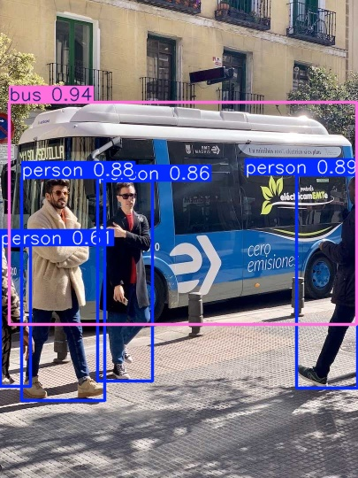
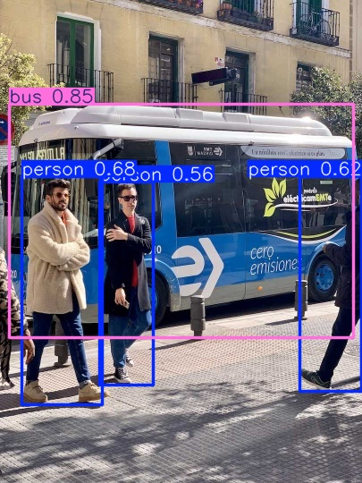

[supported]: https://img.shields.io/badge/-supported-green "supported"

| Chip     | ESP-IDF v5.3           | ESP-IDF v5.4           |
|----------|------------------------|------------------------|
| ESP32-S3 | ![alt text][supported] | ![alt text][supported] |
| ESP32-P4 | ![alt text][supported] | ![alt text][supported] |

# Yolo11 Detect Example

A simple image inference example. In this example, we use ``bus.jpg`` for test. With default setting(iou=0.7, conf=0.25), the detection result before quantization is shown below:



And the detection result after int8 quantization(QAT) is as follows:



## Quick start

Follow the [quick start](https://docs.espressif.com/projects/esp-dl/en/latest/getting_started/readme.html#quick-start) to flash the example, you will see the output in idf monitor:

```
I (4859) yolo11n: [category: 5, score: 0.851953, x1: 10, y1: 116, x2: 395, y2: 377]
I (4869) yolo11n: [category: 0, score: 0.679179, x1: 24, y1: 197, x2: 114, y2: 452]
I (4869) yolo11n: [category: 0, score: 0.622459, x1: 335, y1: 197, x2: 404, y2: 437]
I (4879) yolo11n: [category: 0, score: 0.562177, x1: 111, y1: 203, x2: 171, y2: 430]
```

## Configurable Options in Menuconfig

### Component configuration
We provide the models as components, each of them has some configurable options. See [COCO Detect Model](https://github.com/espressif/esp-dl/blob/master/models/coco_detect/README.md).

### Project configuration

- CONFIG_PARTITION_TABLE_CUSTOM_FILENAME

If model location is set to FLASH partition, please set this option to `partitions2.csv`

