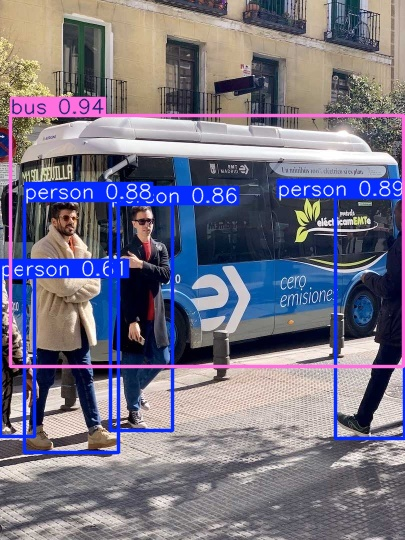

[supported]: https://img.shields.io/badge/-supported-green "supported"

| Chip     | ESP-IDF v5.3           | ESP-IDF v5.4           |
|----------|------------------------|------------------------|
| ESP32-S3 | ![alt text][supported] | ![alt text][supported] |
| ESP32-P4 | ![alt text][supported] | ![alt text][supported] |

# Yolo11 Detect Example

A simple image inference example. In this example, we use ``bus.jpg`` for test. With default setting(iou=0.7, conf=0.25), the detection result before quantization is shown below:



And the detection result after int8 quantization(QAT) is as follows:


## Quick start

Follow the [quick start](https://docs.espressif.com/projects/esp-dl/en/latest/getting_started/readme.html#quick-start) to flash the example, you will see the output in idf monitor:

```
I (4447) yolo11n: [category: 5, score: 0.939913, x1: 2, y1: 115, x2: 399, y2: 366]
I (4447) yolo11n: [category: 0, score: 0.904651, x1: 25, y1: 200, x2: 119, y2: 451]
I (4457) yolo11n: [category: 0, score: 0.817575, x1: 110, y1: 202, x2: 173, y2: 430]
I (4457) yolo11n: [category: 0, score: 0.817575, x1: 334, y1: 198, x2: 404, y2: 439]
I (4477) main_task: Returned from app_main()

```

## Configurable Options in Menuconfig

### Component configuration
We provide the models as components, each of them has some configurable options. See [COCO Detect Model](https://github.com/espressif/esp-dl/blob/master/models/coco_detect/README.md).

### Project configuration

- CONFIG_PARTITION_TABLE_CUSTOM_FILENAME

If model location is set to FLASH partition, please set this option to `partitions2.csv`

