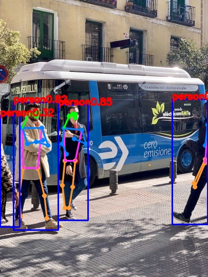

[supported]: https://img.shields.io/badge/-supported-green "supported"

| Chip     | ESP-IDF v5.3           | ESP-IDF v5.4           |
|----------|------------------------|------------------------|
| ESP32-S3 | ![alt text][supported] | ![alt text][supported] |
| ESP32-P4 | ![alt text][supported] | ![alt text][supported] |

# Yolo11 Pose Example

A simple image inference example. In this example, we use ``bus.jpg`` for test. With default setting(iou=0.7, conf=0.25), the outputs on ESP32-p4 after int8 quantization is as follows:



## Quick start

Follow the [quick start](https://docs.espressif.com/projects/esp-dl/en/latest/getting_started/readme.html#quick-start) to flash the example, you will see the output in idf monitor:

```
I (5517) yolo11n-pose: [score: 0.851953, x1: 113, y1: 204, x2: 171, y2: 429]
I (5517) yolo11n-pose: nose: [146, 229] left eye: [146, 222] right eye: [141, 222] left ear: [0, 0] right ear: [134, 226] left shoulder: [159, 253] right shoulder: [124, 249] left elbow: [167, 280] right elbow: [121, 280] left wrist: [144, 270] right wrist: [129, 300] left hip: [146, 313] right hip: [126, 313] left knee: [141, 364] right knee: [121, 361] left ankle: [134, 405] right ankle: [126, 405] 
I (5547) yolo11n-pose: [score: 0.817575, x1: 26, y1: 199, x2: 113, y2: 448]
I (5557) yolo11n-pose: nose: [70, 226] left eye: [73, 219] right eye: [65, 222] left ear: [0, 0] right ear: [55, 222] left shoulder: [81, 249] right shoulder: [43, 249] left elbow: [93, 283] right elbow: [53, 280] left wrist: [70, 276] right wrist: [83, 273] left hip: [73, 327] right hip: [45, 327] left knee: [86, 381] right knee: [37, 378] left ankle: [91, 425] right ankle: [40, 421] 
I (5597) yolo11n-pose: [score: 0.777300, x1: 335, y1: 193, x2: 404, y2: 437]
I (5597) yolo11n-pose: nose: [0, 0] left eye: [0, 0] right eye: [0, 0] left ear: [0, 0] right ear: [0, 0] left shoulder: [404, 243] right shoulder: [0, 0] left elbow: [399, 283] right elbow: [0, 0] left wrist: [0, 0] right wrist: [0, 0] left hip: [399, 317] right hip: [399, 310] left knee: [379, 364] right knee: [377, 357] left ankle: [0, 0] right ankle: [0, 0] 
I (5627) yolo11n-pose: [score: 0.320821, x1: 0, y1: 225, x2: 38, y2: 442]
I (5637) yolo11n-pose: nose: [0, 0] left eye: [0, 0] right eye: [0, 0] left ear: [0, 0] right ear: [0, 0] left shoulder: [0, 0] right shoulder: [0, 0] left elbow: [0, 0] right elbow: [0, 0] left wrist: [0, 0] right wrist: [0, 0] left hip: [0, 0] right hip: [0, 0] left knee: [0, 0] right knee: [0, 0] left ankle: [0, 0] right ankle: [0, 0] 
I (5677) main_task: Returned from app_main()

```

## Configurable Options in Menuconfig

### Component configuration

We provide the models as components, each of them has some configurable options. 

### Project configuration

- CONFIG_PARTITION_TABLE_CUSTOM_FILENAME

If model location is set to FLASH partition, please set this option to `partitions2.csv`

