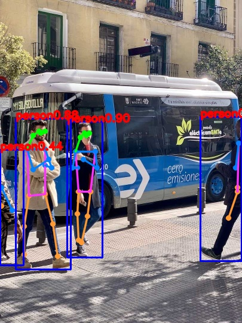

[supported]: https://img.shields.io/badge/-supported-green "supported"

| Chip     | ESP-IDF v5.3           | ESP-IDF v5.4           |
|----------|------------------------|------------------------|
| ESP32-S3 | ![alt text][supported] | ![alt text][supported] |
| ESP32-P4 | ![alt text][supported] | ![alt text][supported] |

# Yolo11 Pose Example

A simple image inference example. In this example, we use ``bus.jpg`` for test. With default setting(iou=0.7, conf=0.25), the outputs on ESP32-p4 after int8 quantization(QAT) is as follows:



## Quick start

Follow the [quick start](https://docs.espressif.com/projects/esp-dl/en/latest/getting_started/readme.html#quick-start) to flash the example, you will see the output in idf monitor:

```
I (5133) yolo11n-pose: [score: 0.904651, x1: 112, y1: 203, x2: 171, y2: 430]
I (5133) yolo11n-pose: nose: [144, 226] left eye: [149, 222] right eye: [141, 222] left ear: [0, 0] right ear: [134, 229] left shoulder: [159, 253] right shoulder: [126, 253] left elbow: [162, 280] right elbow: [121, 280] left wrist: [139, 266] right wrist: [129, 280] left hip: [151, 320] right hip: [131, 320] left knee: [146, 361] right knee: [129, 357] left ankle: [136, 405] right ankle: [131, 401] 
I (5163) yolo11n-pose: [score: 0.880797, x1: 26, y1: 198, x2: 118, y2: 450]
I (5173) yolo11n-pose: nose: [68, 222] left eye: [75, 219] right eye: [65, 219] left ear: [0, 0] right ear: [55, 226] left shoulder: [75, 249] right shoulder: [45, 249] left elbow: [86, 280] right elbow: [55, 283] left wrist: [75, 276] right wrist: [81, 266] left hip: [75, 324] right hip: [48, 327] left knee: [88, 374] right knee: [40, 378] left ankle: [96, 428] right ankle: [40, 425] 
I (5213) yolo11n-pose: [score: 0.880797, x1: 335, y1: 195, x2: 404, y2: 436]
I (5213) yolo11n-pose: nose: [0, 0] left eye: [0, 0] right eye: [0, 0] left ear: [0, 0] right ear: [0, 0] left shoulder: [399, 239] right shoulder: [0, 0] left elbow: [394, 280] right elbow: [0, 0] left wrist: [0, 0] right wrist: [0, 0] left hip: [397, 320] right hip: [397, 313] left knee: [382, 364] right knee: [0, 0] left ankle: [0, 0] right ankle: [0, 0] 
I (5243) yolo11n-pose: [score: 0.437824, x1: 0, y1: 250, x2: 39, y2: 443]
I (5253) yolo11n-pose: nose: [0, 0] left eye: [0, 0] right eye: [0, 0] left ear: [0, 0] right ear: [0, 0] left shoulder: [0, 0] right shoulder: [0, 0] left elbow: [2, 313] right elbow: [0, 0] left wrist: [20, 351] right wrist: [0, 0] left hip: [2, 344] right hip: [0, 0] left knee: [0, 0] right knee: [0, 0] left ankle: [0, 0] right ankle: [0, 0] 
```

## Configurable Options in Menuconfig

### Component configuration

We provide the models as components, each of them has some configurable options. 

### Project configuration

- CONFIG_PARTITION_TABLE_CUSTOM_FILENAME

If model location is set to FLASH partition, please set this option to `partitions2.csv`

