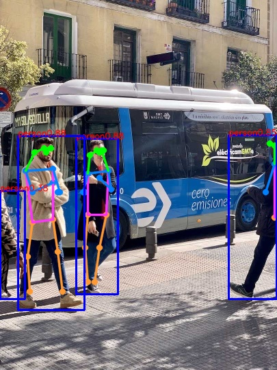

[supported]: https://img.shields.io/badge/-supported-green "supported"

| Chip     | ESP-IDF v5.3           | ESP-IDF v5.4           |
|----------|------------------------|------------------------|
| ESP32-S3 | ![alt text][supported] | ![alt text][supported] |
| ESP32-P4 | ![alt text][supported] | ![alt text][supported] |

# Yolo11 Pose Example

A simple image inference example. In this example, we use ``bus.jpg`` for test. With default setting(iou=0.7, conf=0.25), the outputs on ESP32-p4 after int8 quantization(QAT) is as follows:



## Quick start

Follow the [quick start](https://docs.espressif.com/projects/esp-dl/en/latest/getting_started/readme.html#quick-start) to flash the example, you will see the output in idf monitor:

```
I (4640) yolo11n-pose: [score: 0.880797, x1: 111, y1: 202, x2: 172, y2: 429]
I (4640) yolo11n-pose: nose: [145, 222] left eye: [151, 219] right eye: [141, 219] left ear: [148, 219] right ear: [131, 226] left shoulder: [158, 249] right shoulder: [128, 253] left elbow: [162, 276] right elbow: [121, 280] left wrist: [145, 259] right wrist: [124, 280] left hip: [155, 313] right hip: [128, 313] left knee: [145, 361] right knee: [124, 361] left ankle: [138, 411] right ankle: [128, 411] 
I (4680) yolo11n-pose: [score: 0.880797, x1: 26, y1: 198, x2: 123, y2: 452]
I (4690) yolo11n-pose: nose: [67, 222] left eye: [74, 216] right eye: [64, 216] left ear: [0, 0] right ear: [50, 222] left shoulder: [77, 246] right shoulder: [37, 249] left elbow: [87, 280] right elbow: [47, 280] left wrist: [84, 280] right wrist: [77, 266] left hip: [77, 320] right hip: [47, 324] left knee: [84, 367] right knee: [40, 374] left ankle: [91, 425] right ankle: [43, 425] 
I (4720) yolo11n-pose: [score: 0.851953, x1: 334, y1: 197, x2: 404, y2: 436]
I (4730) yolo11n-pose: nose: [0, 0] left eye: [394, 209] right eye: [0, 0] left ear: [401, 212] right ear: [0, 0] left shoulder: [401, 239] right shoulder: [0, 0] left elbow: [388, 280] right elbow: [0, 0] left wrist: [0, 0] right wrist: [0, 0] left hip: [401, 317] right hip: [0, 0] left knee: [0, 0] right knee: [0, 0] left ankle: [0, 0] right ankle: [0, 0] 
I (4760) yolo11n-pose: [score: 0.377541, x1: 0, y1: 278, x2: 36, y2: 436]
I (4760) yolo11n-pose: nose: [0, 0] left eye: [0, 0] right eye: [0, 0] left ear: [0, 0] right ear: [0, 0] left shoulder: [0, 0] right shoulder: [0, 0] left elbow: [0, 0] right elbow: [0, 0] left wrist: [0, 0] right wrist: [0, 0] left hip: [0, 0] right hip: [0, 0] left knee: [0, 0] right knee: [0, 0] left ankle: [0, 0] right ankle: [0, 0] 
I (4800) main_task: Returned from app_main()

```

## Configurable Options in Menuconfig

### Component configuration

We provide the models as components, each of them has some configurable options. 

### Project configuration

- CONFIG_PARTITION_TABLE_CUSTOM_FILENAME

If model location is set to FLASH partition, please set this option to `partitions2.csv`

