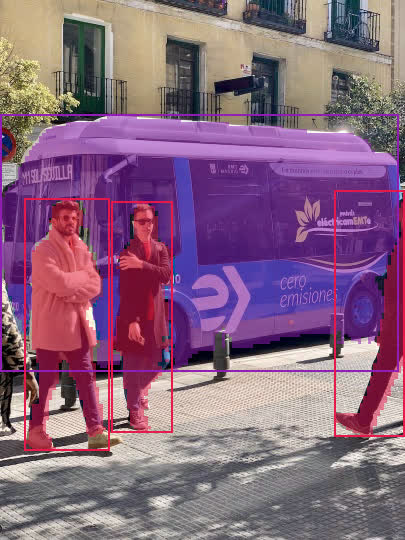

[supported]: https://img.shields.io/badge/-supported-green "supported"

| Chip     | ESP-IDF v5.3           | ESP-IDF v5.4           |
|----------|------------------------|------------------------|
| ESP32-S3 | ![alt text][supported] | ![alt text][supported] |
| ESP32-P4 | ![alt text][supported] | ![alt text][supported] |

# Yolo11 Segmentation Example

A simple image inference example. In this example, we use ``bus.jpg`` for test. With default setting, the outputs on ESP32-p4 after int8 quantization is as follows:



## Quick start

Follow the [quick start](https://docs.espressif.com/projects/esp-dl/en/latest/getting_started/readme.html#quick-start) to flash the example, you will see the output in idf monitor:

```
I (5132) yolo11n-seg: [category: 5, score: 0.851953, x1: 1, y1: 115, x2: 398, y2: 371, mask_pixels: 67546, box_area: 101632]
I (5132) yolo11n-seg: [category: 0, score: 0.851953, x1: 25, y1: 199, x2: 109, y2: 450, mask_pixels: 11771, box_area: 21084]
I (5142) yolo11n-seg: [category: 0, score: 0.817575, x1: 112, y1: 202, x2: 172, y2: 432, mask_pixels: 8545, box_area: 13800]
I (5152) yolo11n-seg: [category: 0, score: 0.817575, x1: 335, y1: 191, x2: 404, y2: 436, mask_pixels: 4578, box_area: 16905]
I (6372) yolo11n-seg: Visualization saved to /sdcard/yolo11_seg_result.bmp
I (6382) main_task: Returned from app_main()

```

## Configurable Options in Menuconfig

### Component configuration

We provide the models as components, each of them has some configurable options. 

### Project configuration

- CONFIG_PARTITION_TABLE_CUSTOM_FILENAME

If model location is set to FLASH partition, please set this option to `partitions2.csv`

