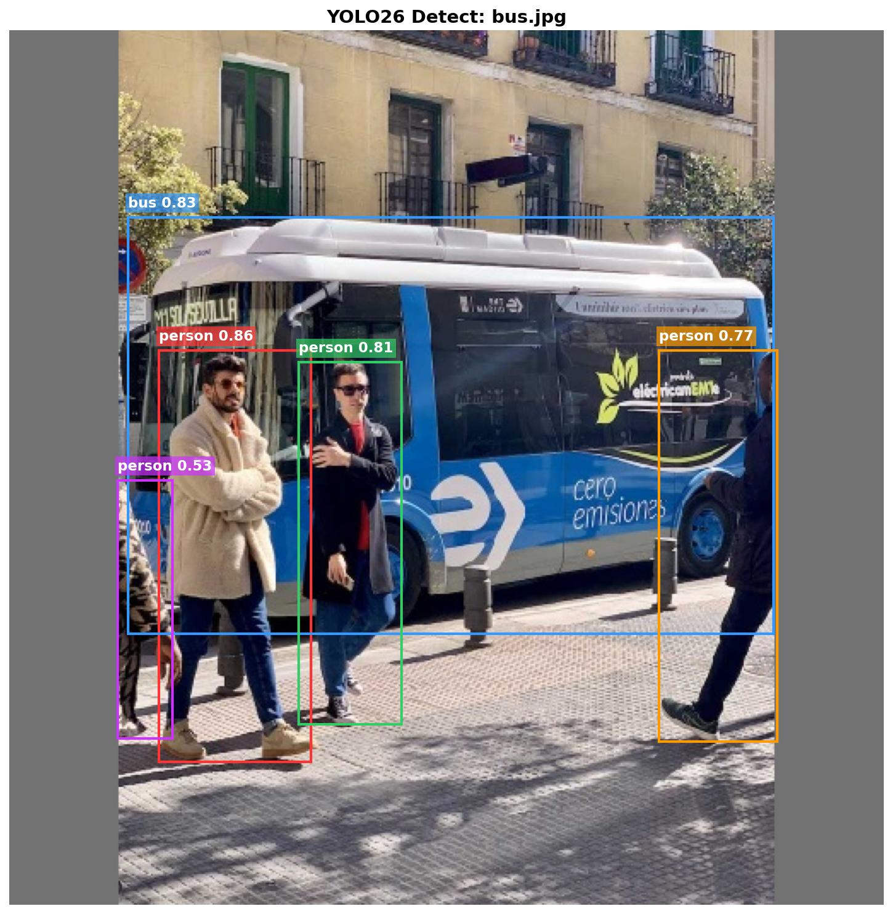
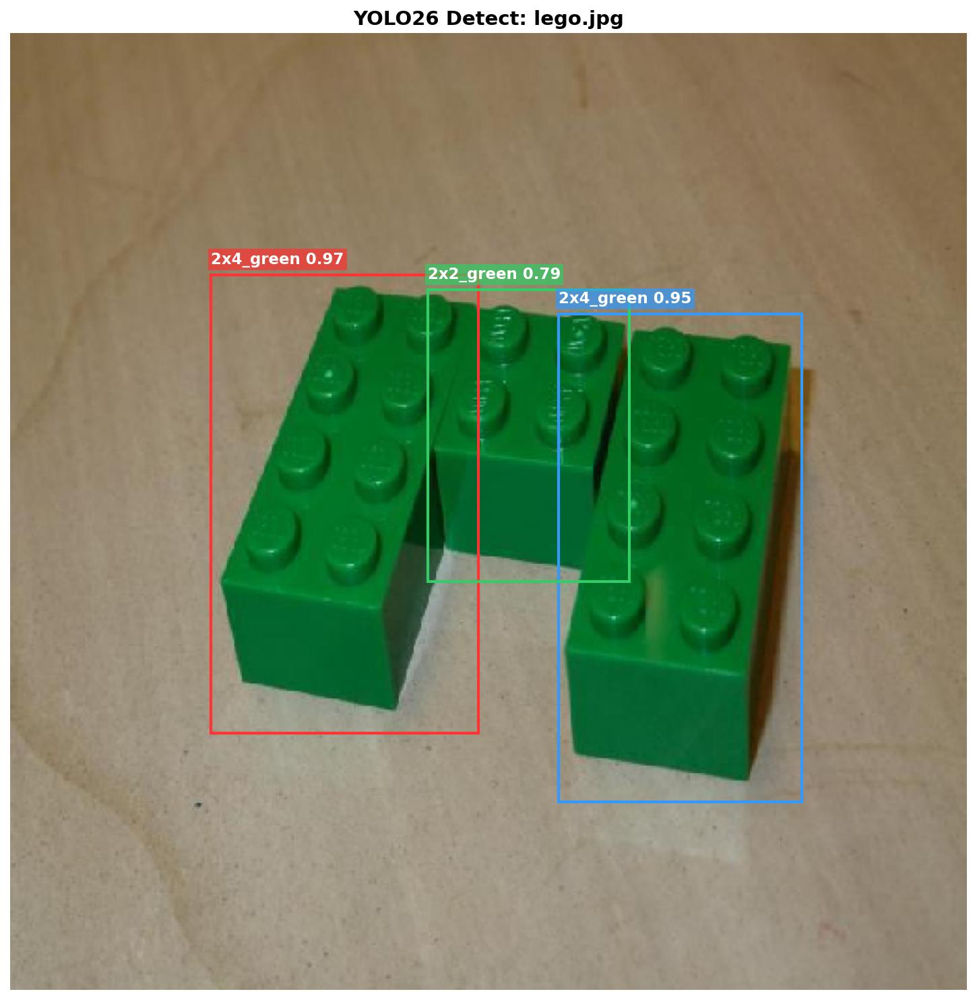

| Supported Targets | ESP32-S3 | ESP32-P4 |
|-------------------|----------|----------|

# YOLOv26n Detect Example

This is a complete end-to-end example for running quantized YOLOv26n inference on Espressif SoCs. 
It features direct regression (No NMS), high performance via `esp-dl` optimizations, and a flexible model loading system.

> **Generic Framework:** This example is designed to run any YOLOv26 model trained on **any dataset**, with **any input size**, and with **any number of classes**. The application automatically adapts to your custom model's configuration.

## Quick Start

1.  **Set Target**
    ```bash
    idf.py set-target esp32p4  # or esp32s3
    ```

2.  **Build and Flash**
    ```bash
    idf.py build flash monitor
    ```

### Expected Output

**ESP32-P4 | 512×512 | COCO model**
```text
I (2158) image:: bus.jpg
I (4348) yolo26_detect: Pre: 12 ms | Inf: 2066 ms | Post: 13 ms
I (4348) YOLO26: [category: person, score: 0.88, x1: 86, y1: 187, x2: 173, y2: 426]
I (4358) YOLO26: [category: bus, score: 0.85, x1: 70, y1: 107, x2: 452, y2: 357]
I (4358) YOLO26: [category: person, score: 0.84, x1: 168, y1: 192, x2: 229, y2: 405]
I (4368) YOLO26: [category: person, score: 0.73, x1: 379, y1: 186, x2: 448, y2: 415]
I (4378) YOLO26: [category: person, score: 0.37, x1: 63, y1: 269, x2: 100, y2: 413]
I (4388) image:: person.jpg
I (6598) yolo26_detect: Pre: 11 ms | Inf: 2066 ms | Post: 13 ms
I (6598) YOLO26: [category: person, score: 0.79, x1: 330, y1: 172, x2: 405, y2: 380]
I (6598) YOLO26: [category: bicycle, score: 0.70, x1: 189, y1: 310, x2: 387, y2: 409]
I (6608) YOLO26: [category: bicycle, score: 0.30, x1: 121, y1: 131, x2: 193, y2: 183]
I (6608) image:: lego.jpg
I (8808) yolo26_detect: Pre: 15 ms | Inf: 2065 ms | Post: 13 ms
```

#### Custom Lego Model Output

**ESP32-P4 | 512×512 | Lego custom model (28 classes)**
```text
I (2140) image:: bus.jpg
I (4280) yolo26_detect: Pre: 12 ms | Inf: 2019 ms | Post: 5 ms
I (4280) image:: person.jpg
I (6430) yolo26_detect: Pre: 11 ms | Inf: 2018 ms | Post: 5 ms
I (6430) image:: lego.jpg
I (8560) yolo26_detect: Pre: 15 ms | Inf: 2018 ms | Post: 5 ms
I (8560) YOLO26: [category: backpack, score: 0.97, x1: 107, y1: 129, x2: 250, y2: 374]
I (8570) YOLO26: [category: backpack, score: 0.95, x1: 293, y1: 150, x2: 423, y2: 411]
I (8570) YOLO26: [category: bird, score: 0.79, x1: 223, y1: 137, x2: 331, y2: 293]
```

## Visualization

We provide a Python script to visualize detection results on the test images.

### 1. Requirements
```bash
pip install matplotlib pillow
```

### 2. Run Visualization
The script reads hardcoded logs (or you can modify it to read from a file) and saves the annotated images to the `results/` folder.

```bash
cd results
python visualize_logs.py
```

### 3. Result
The script generates the annotated images.

| **Model: `yolo26n_512_s8_p4.espdl` (Stock)** | **Model: `yolo26n_lego_512_s8_p4.espdl` (Custom)** |
| :---: | :---: |
|  |  |

## Configurable Options

### 1. Stock Models (Pre-Optimized)
The component includes several pre-quantized models in the model zoo. By default, the build system selects the **512x512** model for your target.

To switch to a different resolution (e.g., 640x640), edit `main/CMakeLists.txt`:

```cmake
# Select a model from the list below
set(MODEL_FILENAME "yolo26n_640_s8_p4.espdl")
```

**Available Models:**

| Resolution | ESP32-P4 Filename | ESP32-S3 Filename |
| :--- | :--- | :--- |
| **512x512** | `yolo26n_512_s8_p4.espdl` (Default) | `yolo26n_512_s8_s3.espdl` (Default) |
| **640x640** | `yolo26n_640_s8_p4.espdl` | `yolo26n_640_s8_s3.espdl` |


### 2. Using Your Own Custom Model

You can easily deploy your own custom-trained YOLOv26n model (e.g., for detecting specific objects like Lego bricks).

#### Step 1: Export & Quantize
Follow the [Quantization Tutorial](../tutorial/how_to_quantize_model/quantize_yolo26/README.md) to generate your quantized `.espdl` model file (e.g., `yolo26n_lego_512_s8_p4.espdl`, which has **28 classes**).

#### Step 2: Place the Model & Classes
Copy your `.espdl` file into the local platform-specific models directory:
```
main/models/[p4|s3]/
```
*(i.e., `main/models/p4/` for ESP32-P4 or `main/models/s3/` for ESP32-S3)*

You can also place your custom C++ header file (e.g., `lego_classes.hpp`) in the same folder. The build system will automatically include it.

#### Step 3: Update Build Configuration
Edit `main/CMakeLists.txt` to point to your new filename:
```cmake
set(MODEL_FILENAME "yolo26n_lego_512_s8_p4.espdl")
```

#### Step 4: Update Application Labels (C++)
If your model detects different classes than COCO (80 classes), you must update the label list in `main/app_main.cpp`.

1.  Create/Edit the header file with your class names (e.g., `lego_classes.hpp`):
    ```cpp
    const char* lego_classes[] = { "brick_2x4", "brick_1x2", ... };
    ```
2.  Include it in `app_main.cpp` and switch the pointer:
    ```cpp
    #include "lego_classes.hpp"  // <--- Found automatically if placed with the model
    // ...
    // Change from coco_classes to your custom list
    // const char **current_classes = coco_classes; 
    const char **current_classes = lego_classes;
    ```

3.  **Build and Flash.** The `YOLO26` component in the application will automatically detect the number of classes from the model file and map them to your new labels provided in `current_classes`.
