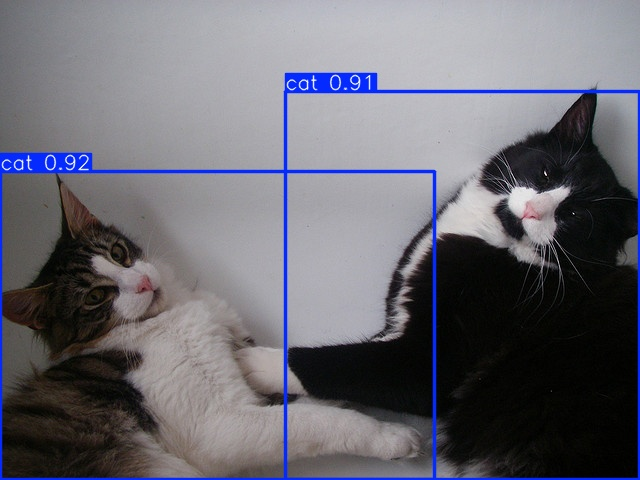
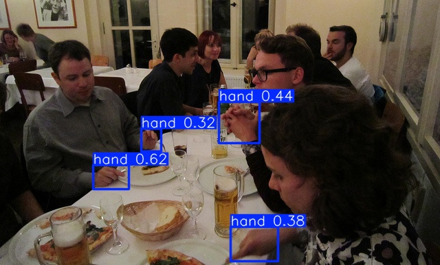
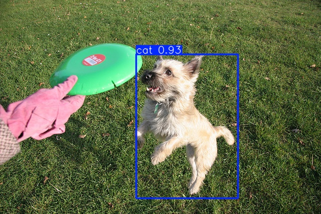
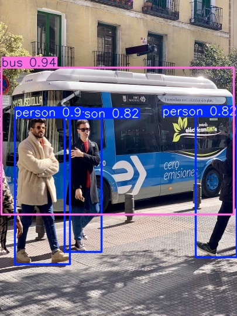

# ESP-DL Model Zoo

| Model Name | Description | Latest Version | Supported Chips | Examples |
| :--- | :--- | :--- | :--- | :--- |
| [**YOLO26**](./yolo26/) | Universal NMS-Free object detection (COCO 80 classes) | [](https://components.espressif.com/components/espressif/yolo26) | ESP32-S3, ESP32-P4 | [Link](../examples/yolo26_detect/) |
| [**COCO Detect**](./coco_detect/) | YOLO11n object detection for 80 COCO categories | [](https://components.espressif.com/components/espressif/coco_detect) | ESP32-S3, ESP32-P4 | [Link](../examples/yolo11_detect/) |
| [**COCO Pose**](./coco_pose/) | YOLO11n-Pose estimation for human keypoints | [](https://components.espressif.com/components/espressif/coco_pose) | ESP32-S3, ESP32-P4 | [Link](../examples/yolo11_pose/) |
| [**Human Face Detect**](./human_face_detect/) | High-performance face detection (MSR/MNP/ESPDet) | [](https://components.espressif.com/components/espressif/human_face_detect) | ESP32-S3, ESP32-P4 | [Link](../examples/human_face_detect/) |
| [**Human Face Recognition**](./human_face_recognition/) | Face feature extraction and ID matching | [](https://components.espressif.com/components/espressif/human_face_recognition) | ESP32-S3, ESP32-P4 | [Link](../examples/human_face_recognition/) |
| [**Cat Detect**](./cat_detect/) | Lightweight cat detection (espdet-pico) | [](https://components.espressif.com/components/espressif/cat_detect) | ESP32-S3, ESP32-P4 | [Link](../examples/cat_detect/) |
| [**Dog Detect**](./dog_detect/) | Lightweight dog detection (espdet-pico) | [](https://components.espressif.com/components/espressif/dog_detect) | ESP32-S3, ESP32-P4 | [Link](../examples/dog_detect/) |
| [**Hand Detect**](./hand_detect/) | Real-time hand detection (espdet-pico) | [](https://components.espressif.com/components/espressif/hand_detect) | ESP32-S3, ESP32-P4 | [Link](../examples/hand_detect/) |
| [**Hand Gesture**](./hand_gesture_recognition/) | Classification of 8+ hand gestures | [](https://components.espressif.com/components/espressif/hand_gesture_recognition) | ESP32-S3, ESP32-P4 | [Link](../examples/hand_gesture_recognition/) |
| [**Imagenet Cls**](./imagenet_cls/) | MobileNetV2 image classification (1000 classes) | [](https://components.espressif.com/components/espressif/imagenet_cls) | ESP32-S3, ESP32-P4 | [Link](../examples/mobilenetv2_cls/) |
| [**Pedestrian Detect**](./pedestrian_detect/) | Pedestrian detection for surveillance/robotics | [](https://components.espressif.com/components/espressif/pedestrian_detect) | ESP32-S3, ESP32-P4 | [Link](../examples/pedestrian_detect/) |
| [**Speaker Verification**](./speaker_verification/) | Voiceprint recognition and verification | [](https://components.espressif.com/components/espressif/speaker_verification) | ESP32-P4 | [Link](../examples/speaker_verification/) |
| [**Motion Detect**](./motion_detect/) | Frame-to-frame motion change detection | [](https://components.espressif.com/components/espressif/motion_detect) | All ESP32 Series | [Link](../examples/motion_detect/) |
| [**Color Detect**](./color_detect/) | Color-based object tracking (OpenCV-mobile) | [](https://components.espressif.com/components/espressif/color_detect) | All ESP32 Series | [Link](../examples/color_detect/) |

## Visual Showcase

<table align="center">
  <tr>
    <td align="center"><br>Cat Detection</td>
    <td align="center"><br>Hand Gesture</td>
    <td align="center"><br>Hand Detection</td>
  </tr>
  <tr>
    <td align="center"><br>Dog Detection</td>
    <td align="center"><br>COCO Detection</td>
  </tr>
</table>

## How to Use Models

All models in this directory are structured as ESP-IDF components. To use them in your project:

1.  **Add as Dependency**: Add the model component to your `main/idf_component.yml` or project root.
2.  **Configuration**: Use `idf.py menuconfig` to select the model location (Flash/PSRAM/SDCard) and default sub-models.
3.  **Loading**:
    ```cpp
    #include "cat_detect.hpp"
    CatDetect *detect = new CatDetect();
    auto results = detect->run(img);
    ```

For detailed metrics and latency, please refer to the `README.md` within each model's directory.
